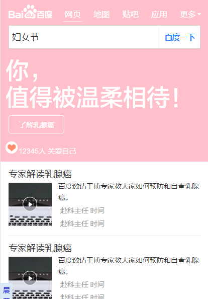

# 李金梅

> 从2017-2-19到2017-2-24

## 暂无项目

### 背景与目标

关注妇女群体，尤其是妇女群体遭受的不公平待遇，引起社会关注，为弱势群体提供帮助，同时可提升百度品牌形象

### 完成情况

2月19日~2月22日  完成卡片的整体开发,
2月23日  学习编码规范并完成编码规范考试,
2月24日  了解情景页开发，阅读相关文档。
 

### 效果截图

### 后续

目前正在调整卡片展示效果