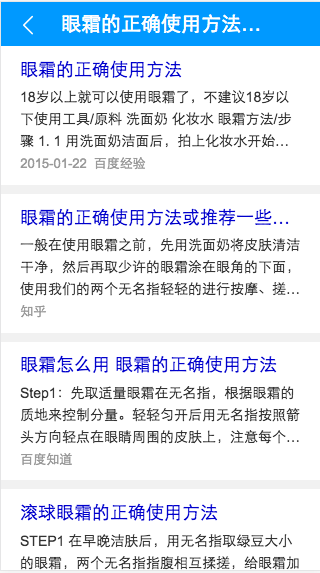

# 司文宇

> 从2.20-2.24

## 情景页迁移

#### 背景

集合医疗、 教育等多个资源的通用卡片迁移。

#### 收益

暂无

#### 工作量评估

* 需求量：牵扯资源较多(6)，卡片历史较老(从KV转成1.0)。排期两天。
* 开发风险 ：无
* 沟通风险：牵扯较多，需和每一个资源的pm确认资源情况。有一定风险。

#### 完成情况

02-04：开发联调完成，pd待上线。

#### 本周进展
02-01：开始接入
02-03：提测
02-04：开发联调完成

#### 排期计划

02-01：开始接入
02-03：提测
02-04：上线

#### 效果

## 新人学习地图

年前学习地图正式迁入文档平台。金梅同学入职，让学习地图接受检验。跟踪她的学习步伐，对文档平台提出建议总结：

* 时间太紧，部分业务目标没有完成。跟林哥反馈情况，需要导师跟进。
* 效果明显，比之前入职包括自己更快接受阿拉丁开发模式，更迅速的接手项目。

## 其他

### 春节年假总结

 这个假请的有点长了。林哥的谈话让我意识到了自己的错误，很抱歉，可能耽搁了一部分工作。下次一定注意。当然可能也没有下次了，因为这是我学生时代最后一个假期。
 
### 需求评审感想
昨天参与了两个需求评审：一个是poi的房产搜索需求，一个是出行的出行助手需求。感觉新年的新项目很给力啊，充满了动力。各位pm都在练习各种资源促成更好的项目，feel great.

### 工作计划

* 首先做好工作。
* 做好毕业相关的材料和任务
* 自我提升，学习技术。《阴阳师》害人不浅，以后每天手游时间不超过1小时~~~

 

