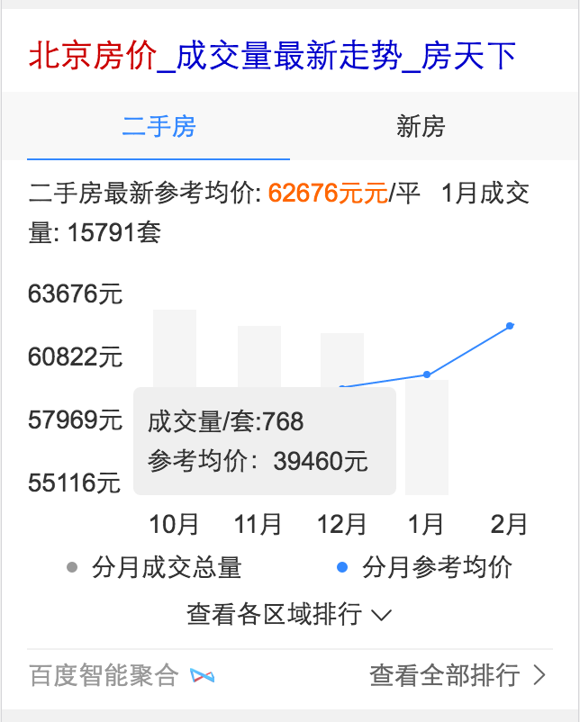

# 李阳阳

> 从2.20-2.24
    
## 房价走势图
* 背景：用户在进行城市/城市区域商圈的房价搜索下，线上均为自然结果展示，且排名靠前的结果多为新闻资讯，无房价及走势内容
的直观展现，导致用户从城市房价换query到城市房价多少钱一平行为较多，新增房价走势卡，将房价信息进行直观展现，减少用户信息
获取步长，提升搜索满意度。
* 完成情况： 
    * 2月9号schema已给出，预计2月15号开始介入
    * 2月15号已介入开发~预计2月22号完成~
    * 2月20到2月23号迁移情景页~2月24号完成~
* 线上预览地址
    * [北京房价](http://cp01-ala-fe-5.epc.baidu.com:8003/s?word=%E5%8C%97%E4%BA%AC%E6%88%BF%E4%BB%B7&wiseus=10.103.76.38)
- 效果图
     

## 情景页1.0到2.0的迁移
* 背景：情景页1.0到2.0的迁移（stockinfo）
* 完成情况： 
    * 2月21号介入开发~
    * 2月22号完成~已申请人力测试~等待排期中~
* 线上预览地址
    * [2017年考研](http://cp01-ala-fe-5.epc.baidu.com:8003/s?pn=10&usm=4&word=2017%E5%B9%B4%E8%80%83%E7%A0%94)
- 效果图
    

