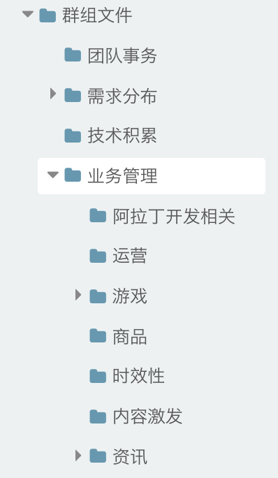

# 谢玲娟

> 从1.16-1.20

## 本周跟进

|内容 |类型|进度 | pv/天 | 
|---|---|---|---|
|激发区-激发列表情景页|优化|2.21已上线|小流量pv100万/日|
|交接文档梳理|——|2.22已交接|——|

## 【时激发区-激发列表情景页优化】

### 背景

激发列表情景页下拉刷新每页加载固定10条。

由于目前后端数据存在这样一个问题：后端先整体rank要返回的所有新闻，然后会去掉无摘要的新闻。当前端去请求下一页的时候，刚好无结果了，而后端也无法在去摘要之后再去告诉前端上一页已经是最后一条了。

而无结果目前的样式比较丑陋，是sf默认的错误页面的样式。sf后续会做一个优化后的统一的无结果样式，但是是整屏的，跟我们的要的效果不符。

因此：需要前端去优化第n页时候无结果的样式。

### 优化前：

### 优化后：

### 进度

2.21已上线

## 交接文档梳理

### 背景

资讯垂类交接三个方向的业务，资讯、时效性、内容激发。目前主要整理下这三个方向的文档相关，用于交接相关。

### 进度

交接文档梳理：2.23已完成 http://agroup.baidu.com/alanews/md/article/238239

其他文档梳理：内容持续补充中。。
