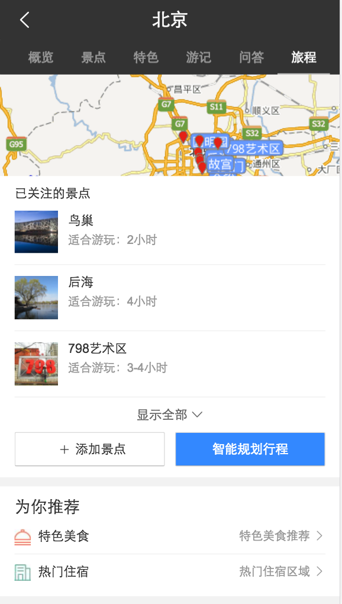
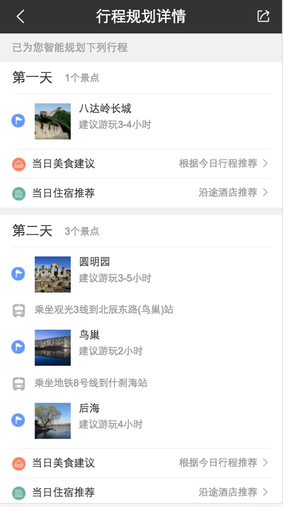
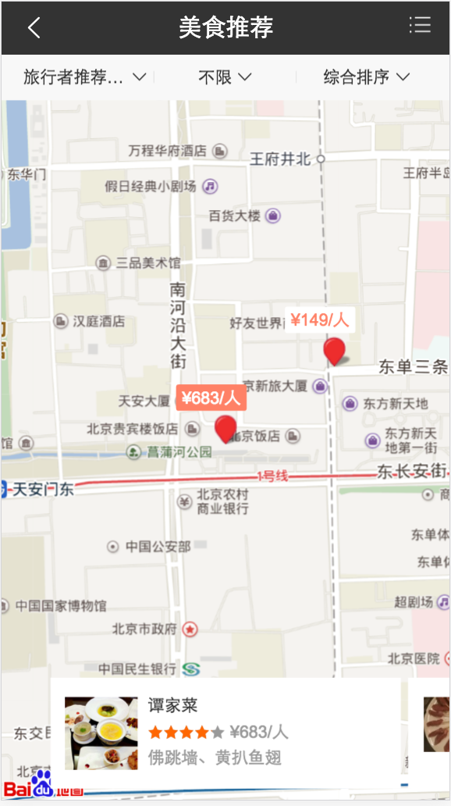
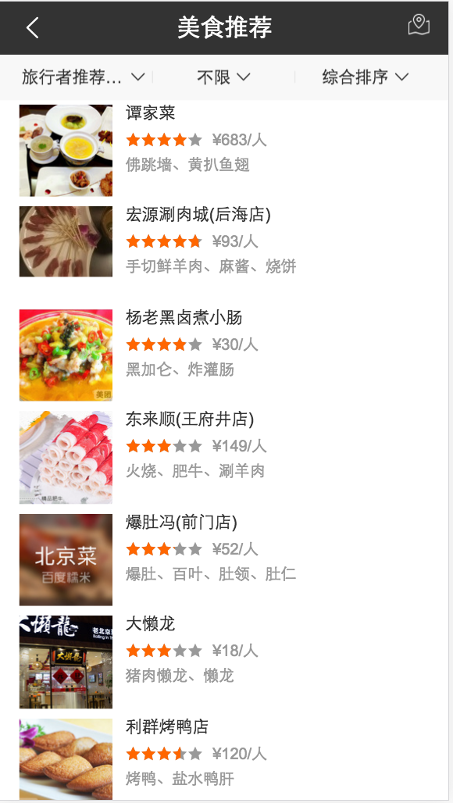

#薛睿娇

> 2016-02-20 ~ 2016-02-24

### 旅游-我的旅程 - (已全量)
- 项目背景

		在用户进行旅游相关搜索时，实质是想了解一段旅程的部分或全部环节;选择想去的目的地，预订机票/火车票，酒店是旅程开始前的关键步骤。我的旅程项目将用户想去的目的地与用户通过百度预订的酒店或大交通行为相合，方便用户查阅旅程相关信息。同时结合用户想去的景点，为用户推荐景点周边的美食酒店，从而形成旅行信息和服务的有机连接。 	

- 收益

		在用户进行旅游相关搜索时，实质是想了解一段旅程的部分和全部环节，我的旅程项目将用户想去的目的地与用户通过百度预定的酒店或大交通行为相结合，方便用户查阅旅程相关信息。同时结合用户想去的景点，为用户推荐景点周边的美食酒店，从而形成旅行信息和服务的有机链接。
- 完成情况（时间点达到的里程碑） 
	* 11-25第二轮评审.
    * 11-28FE介入.
	* 12-07暂停，12-15介入
	* 01-11提测。
	* 01-22零流量上线。
	* 02-10全流量上线。
	
- 本周进展
	
	部分功能调整迭代。
 
- 效果预览
	* [北京](https://m.baidu.com/s?word=%E4%B8%BD%E6%B1%9F&ip=211.137.112.0&sid=7500)
	

	

	

	

	[详见ICAFE](http://newicafe.baidu.com/issue/1496992-5/show?from=page)
	
### 出行-行程助手

- 项目背景 
 
 		用户在百度购票和查询车次航班等信息，代表用户会使用或者关注一个行程，百度在提供基本信息的基础上，还需要提供整个行程过程中动态的信息、满足行程中的潜在需求、连接用户和信息服务，从而提升每次出行的需求满足度，提高用户的复购率。

- 工作量评估 
  - 需求量：
  7个情景页卡片
  - 开发风险：
  需要用到日历组件 | 1次 | 

- 完成情况（时间点达到的里程碑） 
	* 02-23第一轮需求评审.   

- 本周进展
    * 需求评审完成。
- 计划
    * 下周一UE给出UE图 ，开始开发  

### 工作内容与计划

- 本周工作内容
	* 旅程项目需求迭代
	* 行程助手项目需求评审
	* 了解了Vue.js
	* 代码结构优化调整
	* 代码规范度有所提高

- 下周工作计划
	* 开始旅程助手项目开发
	* 开发过程中注意开发规范和代码结构

- 问题与思考
	* 有关于日历组件：日历组件的使用频率越来越高，应该考虑做成一个公用fusion的组件

 