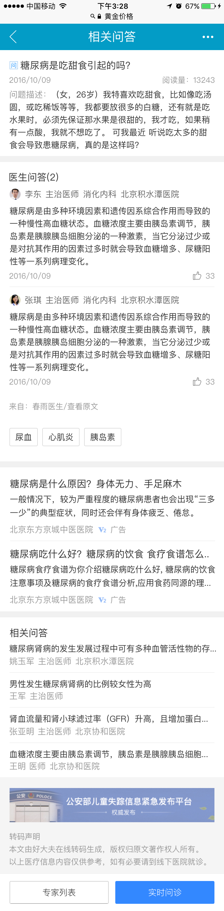
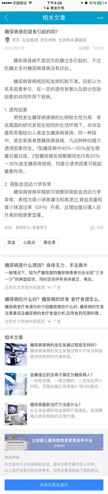

# 郑铎

>从2.20-2.24

## sf1.0迁移（待上线）

### 工作量评估	

* 需求量  ：一个结果页卡片，一个情景页卡片
* 开发风险 ：未开发过sf1.0卡片

### 完成情况

* 2.20 开始迁移

* 2.22 交给pm验收

* 2.23 验收完成，等后台上线

### 本周进展

* 2.20 开始迁移

* 2.22 交给pm验收

* 2.23 验收完成，等后台上线

### 效果图

 

## 医疗c类页面迭代（待开发）

### 背景：
  针对医疗资源方落地页用户体验差，广告泛滥的问题，搜索医疗垂类今年的方向是自建封闭页面，对用户体验和广告体验进行提升和平衡。目标是提升基础页面体验和广告体验，探索多种变现方式。

### 收益：
PV 2000W

### 工作量评估
* 需求量：
    三个c类页面重建（一问多答，多轮交互问答，相关文章）
* 开发风险：
    同时存在同步,异步更新方式（多轮交互问答）
* 沟通风险：
    点赞功能中单个用户的点赞次数存储方案待定
    广告接入方式待定
    c类页面使用mip还是sf开发待定

### 排期计划

    一问多答和交互问答每个模板排期五天，相关文章页面排期四天

### 效果图

* 一问多答

    
* 相关文章

    

* 多轮问答

    

## 工作内容与计划

### 本周工作内容

* sf1.0迁移 ( 模板：wise_expert_answer,act_expert_an )

* 医疗c类页面评审，mip开发学习

### 下周工作计划

* 开始医疗c类页面开发

## 问题与思考

* 模板召回是怎样一个过程，从输入query按回车开始。