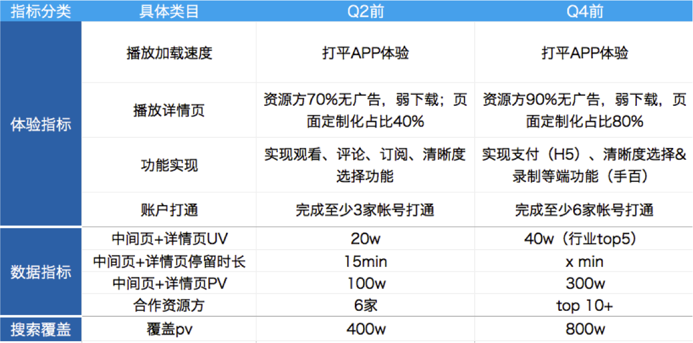
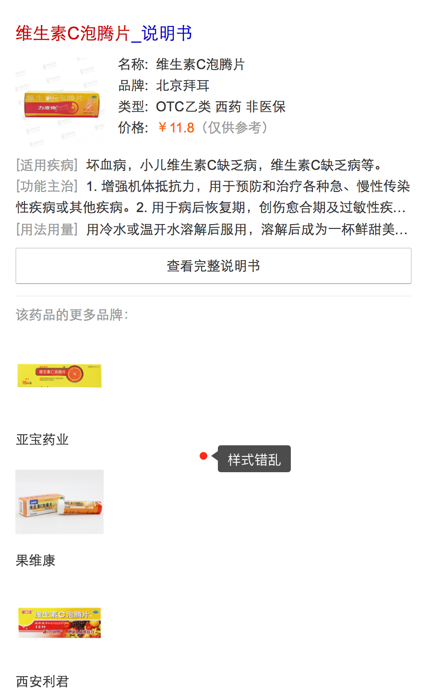
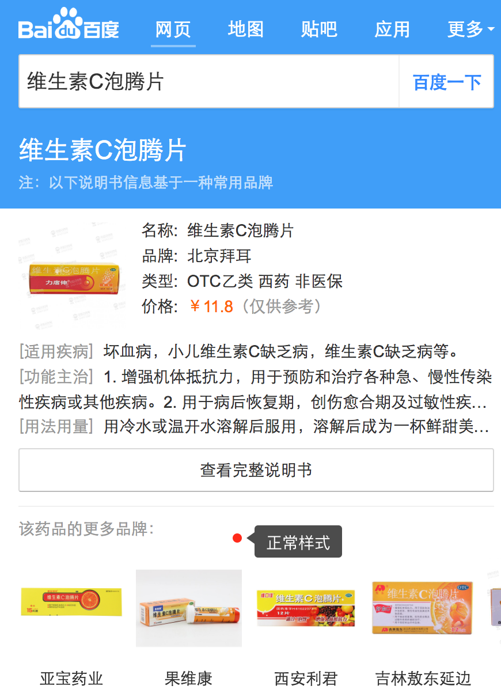
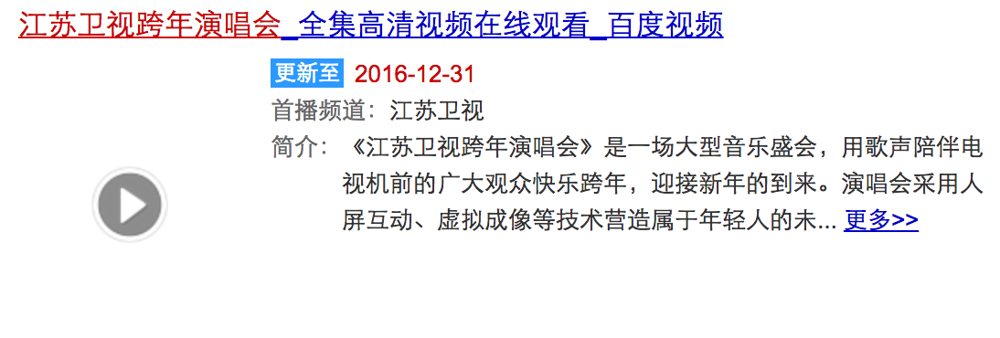

# 谢玲娟

> 从02.27-03.03

## 本周跟进

|内容 |类型|进度 | pv/天 | 
|---|---|---|---|
|游戏直播|新增模板|UE终稿3.3给出，开发8天，预计上线3.23全量pv预计400w|
|游戏资源方接入方案|流程梳理|已梳理部分，下周开始对接，后续继续补充|——|
|图搜-uiapi下sigma展现异常|case|2.21已上线|小流量pv100万/日|
|pc-vd_tamasha图片战线异常|case|——|——|

## 游戏直播

* 背景：直播作为一种快速发展的新媒体形式，无论是数量上、内容上，都在极度扩张，而搜索对直播这类新内容的掌控力较弱。以搜索做入口，可以去聚合多家平台内容，满足并激发用户观看游戏&娱乐直播需求。

* 收益：

* 工作量评估

	* 需求量：新增4个情景页，1个结果页

	* 风险：资源方接入合作页，可能涉及到fe的沟通成本和开发联调工作。按照之前fe的经验，接入一个资源方时间为0.5天或者2周都有可能。

* 完成情况

	* 3.1需求评审

	* 3.3给到UE终稿

	* 3.16联调，fe8天工作量

	* 预计3.23上线
	
* 效果图

	暂无，UE终稿3.3下午给到

## 游戏资源方接入方案

* 背景：

	* 与资源方合作直播页面的技术方案定为：1、短期：在video.pae.baidu.com中嵌入资源方的页面来实现。需要rd将资源放src和其他一些字段拼接起来传给前端，具体参数及拼接方式参考wikihttp://agroup.baidu.com/wed/md/article/111631
2、长期：长期会跟rd建利考虑迁移到新的ae服务，由于http://video.pae.baidu.com 服务视频团队后续不维护了，迁移到新的ae服务方便后续的升级和维护。

	* 目前的video.baidu.com只接入了四家（触手、虎牙、映客、龙珠），考虑到其他资源方（YY、花椒、全民）平滑接入，需要有一个统一的接入方案。

* 工作量评估

	主要涉及到和YY、花椒、全民这三家资源方的联调。

* 完成情况

	* 下周开始与资源放对接。

	* 目前已梳理接入的初步方案[点我查看](http://agroup.baidu.com/alanews/md/article/250308)，流程规范后续补充。。

## 【图搜-uiapi下sigma展现异常】

### case背景

uiapi下样式展现异常：

大搜下的正常sigma样式：

### case原因

	// c_base中，要走到特定逻辑下才会展现sigma
	
	    
	
	    
	

当前的uiapi是不支持sigma卡片的处理的。而模板中把内容非sigma卡的css写到了。因此，sigma退化之后的样式错乱。

### 解决方案

	// 把原先在中定义的对应样式移到中
	

	

	

### 进度

3.2上线。

## pc-vd_tamasha图片战线异常

### 背景

图片展现异常：

### case原因

图片数据问题

### 进展

已移交pm李改变处理。