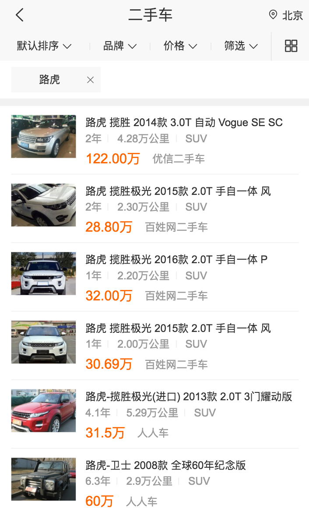
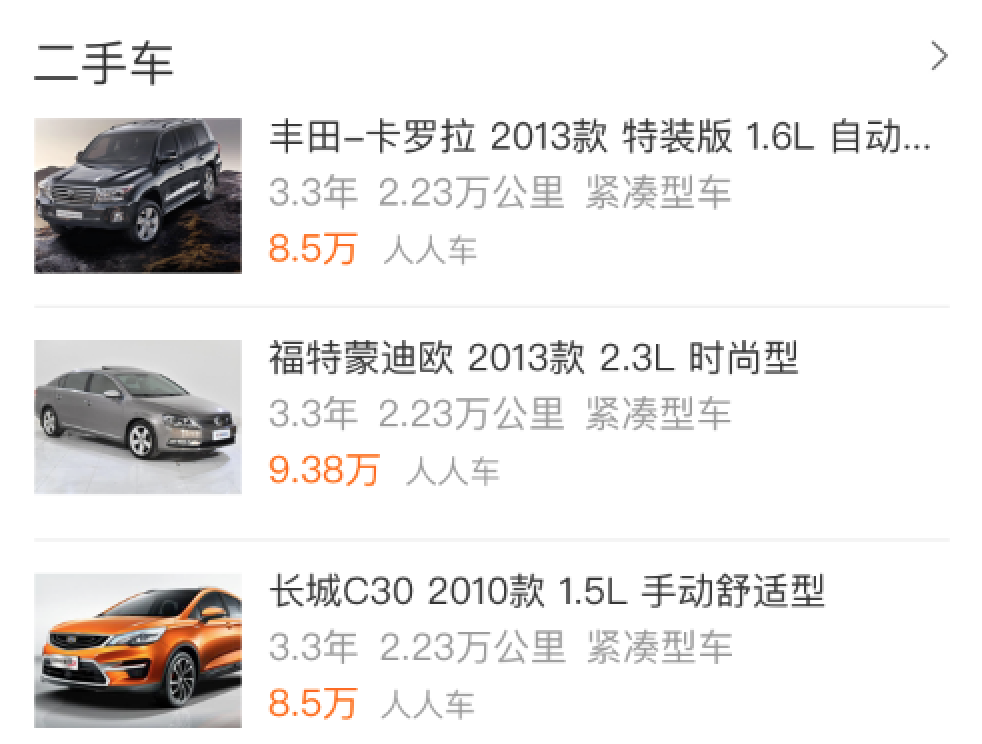
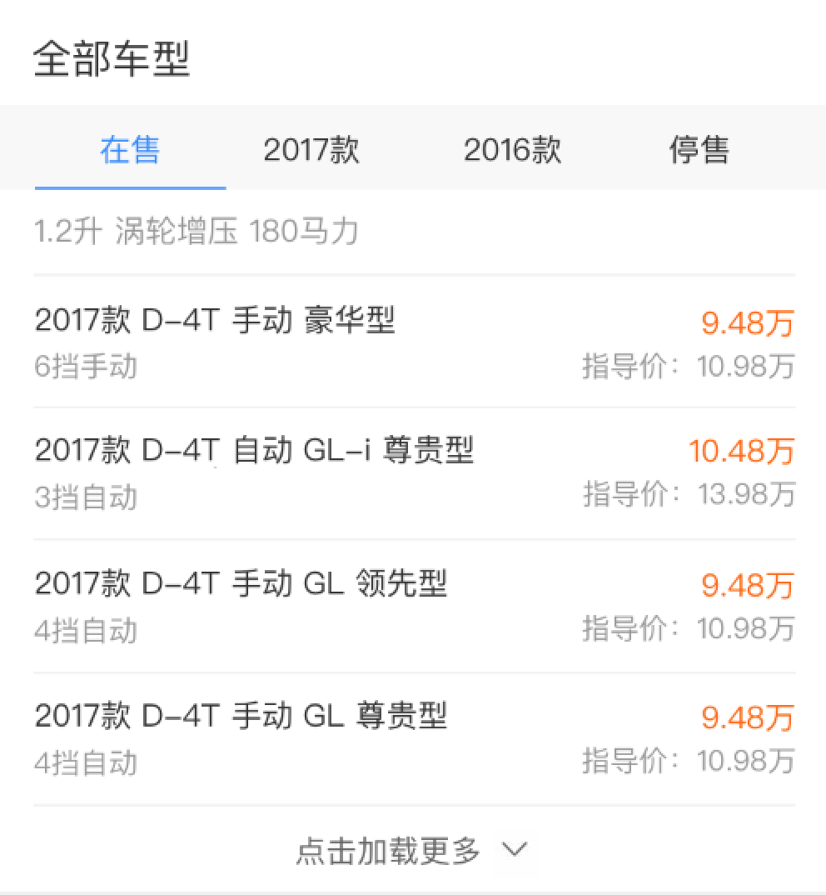

# 杨奇

> 2017年2月26日~2017年3月3日

#### 修改二手车泛需求页面 （项目状态:已上线） @ 杨奇 
- 背景：针对二手车，用户有买车和卖车两方面的需求。而各商家的车源分散，中小型城市的车源不足，且市场上暂无巨头出现，目前呈现三足鼎立之势（优信、人人、瓜子）。百度可通过聚合车源、搭建入口、提供额外优惠等方式，进一步满足用户需求，稳住二手车的流量入口。
- 收益：影响PV 60w 
- **工作量评估** 
  - 需求量：
  1个结果页
  - 开发风险：
     - 无
  - 沟通风险：
     - 无
- **完成情况** 
	 - 3月2日 开始开发
     - 3月2日 开发完毕
     - 3月2日 上线
- 本周进展 
	 - 删除小卡的冗余部分，优化展现
- **排期计划**
	 - 3月2日 模版上线 
- 效果图
    

    
    
#### 修改二手车情景页线上bug （项目状态:待上线） @ 杨奇 
- 背景：针对二手车，用户有买车和卖车两方面的需求。而各商家的车源分散，中小型城市的车源不足，且市场上暂无巨头出现，目前呈现三足鼎立之势（优信、人人、瓜子）。百度可通过聚合车源、搭建入口、提供额外优惠等方式，进一步满足用户需求，稳住二手车的流量入口。
- 收益：影响PV 60w 
- **工作量评估** 
  - 需求量：
  1个情景页
  - 开发风险：
     - 同时需要用同步获取数据和异步获取数据
  - 沟通风险：
     - 无
- **完成情况** 
	 - 3月2日 开始开发
     - 3月2日 开发完毕
     - 3月3日 准备上线
- 本周进展 
	 - 线上出现首屏同步数据展现跳转链接未加密，现已加密完毕。
- **排期计划**
	 - 3月3日 模版上线 
- 效果图
    

    
#### 汽车项目 （项目状态:开发中） @ 杨奇 
- 背景：本项目是满足搜索上新车部分的需求，重点满足用户选车的需求。 影响选车的决策因素很多，主要有：配置、报价、口碑、评测（文章、视频）等。从query分析可看出，选车需求的用户的TOP QUERY为车系词、品牌词以及泛需求词。
- 收益：影响PV 970w 
- **工作量评估** 
  - 需求量：
  3个情景页
  - 开发风险：
     - 有两个情景页同时需要用同步获取数据和异步获取数据
  - 沟通风险：
     - 图片情景页数据rd还没给出，先自定的schema
     - 车型的异步数据rd未给出，联调时才能给出
- **完成情况** 
	 - 2月27日 开始开发
     - 3月7日 开发完毕
- 本周进展 
	 - 完成了二手车和车型模板的开发
- **排期计划**
	 - 3月7日 开发完毕
	 - 3月末  和rd联调
- 效果图
    

	

    

#### 工作内容与计划 @杨奇
- 本周工作内容
	- 修改二手车返修求的卡片，修改二手车线上bug，开发汽车项目的三个情景页，学习etpl的简化代码，学习并应用情景页的开发规范，学习linux指令和测试机的应用。
- 下周工作计划
	- 学习etpl，打算学习编码逻辑最近感觉编码时自己的逻辑时而有漏洞，要针对问题再去构思想别的方式去解决问题，影响了编码的速度，开发汽车项目的其他卡片。

#### 问题与思考 @杨奇
- 我很想知道在编写程序的时候，有经验的老员工会怎么整体的思考全局的逻辑，以避免出现逻辑漏洞，还要解决代码的衔接问题。

