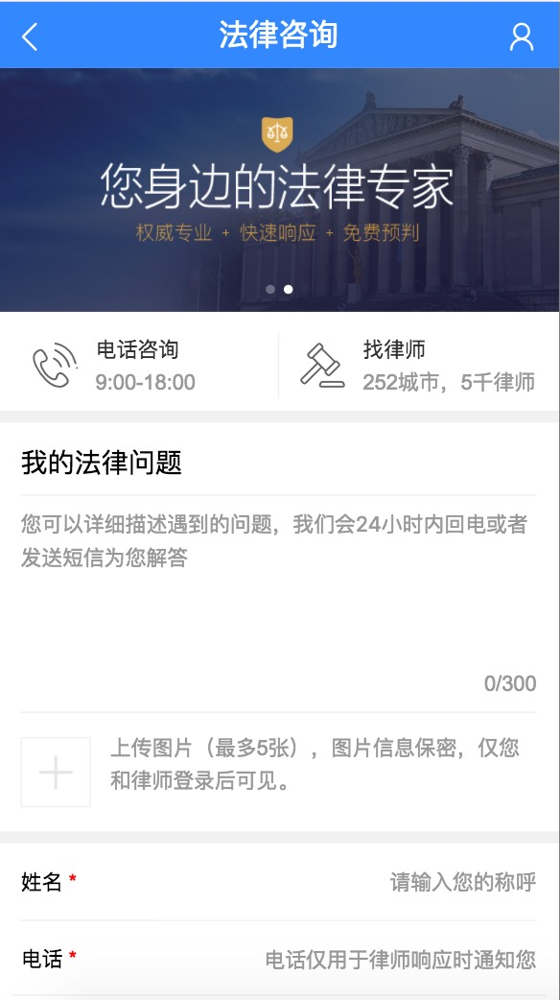

# 张屾

> 从2017-2-27到2016-3-3

## 人员安排
```
招聘B：张屾（0.5），刘玲玲
招聘站：冯斐帆
专家：胡晓卉
模板平台：张屾（0.5）
```

#### 招聘B （项目状态: 开发中）

- 背景：开放平台对接的垂类之一。to B项目，需要做接入、审核、发布、管理等招聘相关的功能模块。聚焦在pc端以及移动端上。目前招聘
     已经确定一期的全部需求，后端2月底前联调通api与数据层接口。前端需要整体考虑开放平台的重构和后期rd的维护成本，将框架和
     新的技术选型应用在招聘这个垂类，慢慢再延伸到整个开放平台。

- 预期收益：
  － 暂无

- **工作量评估** 
  - 需求量：
     - 开发 前端15人日
  - 开发风险：
     - 新框架有学习成本 
     - 部分组件通用型开发
- **完成情况** 
     - 15% 前端脚手架选择及搭建完毕，
     - 5%  玲玲进入页面逻辑及组件开发，目前不是很熟悉，后期需要一起带做业务逻辑

#### 专家线315运营（项目状态: 开发中）

- 背景：百度搜索16年年底自建法律平台页面，引入行业专家，为用户提供除网络现有免费资源外更专业的服务。为提升产品影响力和知名度，在2017年3月15日-16日通过时效性大卡固定Tab位+feed流的形式，在搜索结果页、百家号及wise结果页底部浮层、微博等渠道展开宣传运营活动，解决用户在315期间维权搜索上的时效性刚需&个性化问题解答。

- 预期收益：
 - 为百家号带来5w阅读；百度专家内容页总PV过10w；
 - 整体PV及用户提问数增长，达到平台目前以来日均峰值；
 - 满足用户时效性需求，优化315检索体验；
 
- **工作量评估** 
  - 需求量：
    2个新页面，1个已有页面
    
  - 开发风险：
     - 使用未沉淀的交互方式 | 2次 | 内容提交页banner定时滚动、横滑切换；分享组件解耦
     - 同时存在同步、异步更新方式 | 1次 | 带有动态参数的路径之间跳转的时候，由于会渲染同样的组件，因此组件实例会被复用，页面不会刷新。

  - 沟通风险：
     - 开发方案 | 1 次 | 文章内容的提交方式
     - 效果图定稿问题 | 2 次 | 提交页标注图周四给出； banner头图部分还未定稿 
     
- **完成情况** 
     - 2月27日~3月02日 整体开发完毕
     
- 本周进展 
	 - 本周整体开发完毕，预计下周跟测、上线。
	 
- **排期计划**
	 - 2月27日~3月02日 开发
     - 3月03日 联调
     - 3月06日~3月07日 测试
	 - 3月08日 上线
	 
- 效果图
    <p></p>
    
#### 专家平台-百度医生下线 （项目状态: 开发中）

- 背景：医疗垂类资源方百度医生3月3日将停止服务。

- **工作量评估** 
  - 需求量：
    2个页面样式调整
     
- **完成情况** 
     - 3月03日 开发中
- 本周进展 
	 - 3月03日 开发中
- **排期计划**
	 - 3月03日 开发、上线   
	  
#### 百聘中间页优化-招聘节运营 （项目状态: 开发完成，已上线）

- 背景：百度百聘新增招聘节页面（pc端和wise端都有），上周进行了上线，这周针对wise端页面进行了优化。主要优化点是：1、取消了跳转第三方的链接。2、在运营页面判断登录和非登陆两种状态。

- 收益：
 - 日均pv约6w，日均uv约4w。
 
- **工作量评估** 
  - 需求量：
    pc和wise各一个页面优化
    
  - 开发风险：
     - 优化期间涉及登录的部分非手百浏览器已测，手百在测试环境下无法进行登录验证，只能上线后测试。

  - 沟通风险：
     - 无
     
- **完成情况** 
     - 周四已经完成上线。
     
- 本周进展 
	 - 已经上线。
	 
- **排期计划**
	 - 无
	 
- 效果
    pc： http://zhaopin.baidu.com/zhaopinjie
    wise：http://zhaopin.baidu.com/m/zhaopinjie
  
    
#### 百聘中间页wise端-na吊起开发 （项目状态: 开发完成，已上线）

- 背景：百度百聘本周进行了na吊起的开发，主要涉及百聘中间页的所有类目的登录吊起。

- 收益：
 - 用户体验收益：用户在使用手百访问百度百聘时，登录速度和体验都会提高。
 
- **工作量评估** 
  - 需求量：
    涉及wise端中间页18个页面的调整。
    
  - 开发风险：
     - 优化期间涉及登录的部分非手百浏览器已测，手百在测试环境下无法进行登录验证，只能上线后测试。

  - 沟通风险：
     - 开发测试期间由于手百线下测试无法登录以及登录吊起部分存在bug，和手百人员沟通多次|3次|最终解决问题
     
- **完成情况** 
     - 周四已经完成上线。
     
- 本周进展 
	 - 已经上线。
	 
- **排期计划**
	 - 无
	 
- 效果
    wise：http://zhaopin.baidu.com/m
    
#### 百聘中间页pc端-个人中心页面开发 （项目状态: 完成20%）

- 背景：百度百聘本周周四进行了pc端个人中心页面的开发，完成了20%的模板样式。

- 预计收益：
 - 带来用户日均简历数的提高。
 
- **工作量评估** 
  - 需求量：
    pc端一个新页面。
    
  - 开发风险：
     - 无。

  - 沟通风险：
     - 样式上在完成模板开发后会再和pm、ue确认一次|1次|--
     
- **完成情况** 
     - 已经完成20%，预计下周开发完成。
     
- 本周进展 
	 - 已完成20%。
	 
- **排期计划**
	 - 下周继续开发
	 
- 效果
    pc：http://cq01-w-ps-2011q3-ndi212.cq01.baidu.com:8888/userinfo	  

#### 其他机动任务
