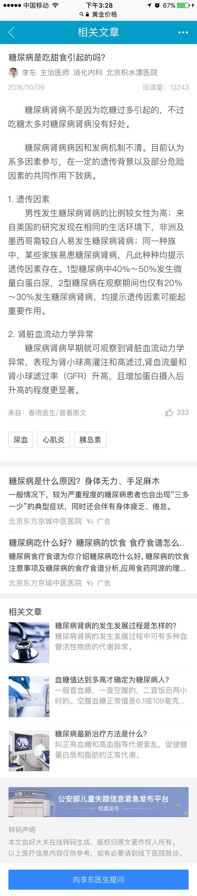

# 郑铎

>从2.27-3.03

## sf1.0迁移（已上线）

### 工作量评估	

* 需求量  ：一个结果页卡片，一个情景页卡片
* 开发风险 ：未开发过sf1.0卡片

### 完成情况

* 2.20 开始迁移

* 2.22 交给pm验收

* 2.23 验收完成，等后台上线

### 本周进展

* 3.1 完成上线

### 效果图

 

## 医疗c类页面迭代（开发中）

### 背景：
  针对医疗资源方落地页用户体验差，广告泛滥的问题，搜索医疗垂类今年的方向是自建封闭页面，对用户体验和广告体验进行提升和平衡。目标是提升基础页面体验和广告体验，探索多种变现方式。

### 收益：
PV 2000W

### 工作量评估
* 需求量：
    三个c类页面重建（一问多答，多轮交互问答，相关文章）
* 开发风险：
    同时存在同步,异步更新方式（多轮交互问答）
* 沟通风险：
    点赞功能中单个用户的点赞次数存储方案待定
    广告接入方式待定
    c类页面使用mip还是sf开发待定

### 排期计划

    2.28~3.1  完成凤巢广告联调@郑铎
    3.2~3.9   一问多答模板开发@郑铎
    3.6~3.14  相关文章模板开发@李金梅
    3.10~3.13 一问多答模板联调@郑铎
    3.14~3.17 交互问答模板开发@郑铎
    3.14~3.17 相关文章模板联调@李金梅
    3.20~3.21 交互问答模板联调@郑铎
    3.20~3.22 测试
    3.22~3.23 ue走查
    3.24      上线    

### 完成情况

    2.28~3.1 凤巢广告联调完成
    3.2      一问多答模板建数据

### 本周进展

    2.28~3.1 凤巢广告联调完成
    3.2      一问多答模板建数据
    3.3      一问多答模板开始开发

### 效果图

* 一问多答

    
* 相关文章

    

* 多轮问答

    

## 工作内容与计划

### 本周工作内容

* sf1.0迁移上线 ( 模板：wise_expert_answer,act_expert_an )

* 医疗c类页面凤巢广告联调完成

* 医疗c类页面一问多答模板数据格式建完

### 下周工作计划

* 一问多答模板开发完成，并开始联调

