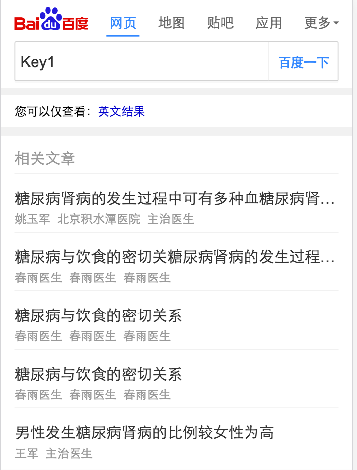

# 李金梅

> 从2017-3-6到2017-3-10

## 医疗c类页面迭代（开发中）@郑铎@李金梅

### 背景

针对医疗资源方落地页用户体验差，广告泛滥的问题，搜索医疗垂类今年的方向是自建封闭页面，对用户体验和广告体验进行提升和平衡。目标是提升基础页面体验和广告体验，探索多种变现方式。

### 工作量评估

* 需求量：
三个c类页面重建（一问多答，多轮交互问答，相关文章共三张sf卡）
* 开发风险
同时存在同步,异步更新方式（多轮交互问答卡片）
* 沟通风险
点赞功能中单个用户的点赞次数存储方案待定
需要修改所有跳转到c类页面的入口，包含一张NLP结果卡
凤巢和网盟广告接入
c类页面使用mip还是sf开发待定

* 排期计划
2.28~3.1 完成凤巢广告联调,广告部分单独开发成一个module@郑铎
3.2~3.9 一问多答模板开发(一张sf卡)@郑铎
3.6~3.14 相关文章模板开发(一张sf卡)@李金梅
3.10~3.13 一问多答模板联调@郑铎
3.14~3.17 交互问答模板开发(一张sf卡)@郑铎
3.14~3.17 相关文章模板联调@李金梅
3.20~3.21 交互问答模板联调@郑铎
3.20~3.22 测试
3.22~3.23 ue走查
3.24 上线

### 完成情况

2.28~3.1 凤巢广告联调完成，广告引入部分单独开发一个module
3.2 一问多答模板建数据
3.6 一问多答卡片第一版开发完成
3.7~3.8 真实数据联调完成
3.9 ue走查结束，跳转入口修改完成
3.8 卡片编写完成，目前正在等待pm提供数据以进行校验

### 本周进展

3.6 一问多答卡片第一版开发完成
3.7~3.8 真实数据联调完成，开始走查和测试，修改跳转入口。
3.9 走查和测试结束，跳转入口修改完成(两个sf卡，两个结果页卡)。

### 效果

### 排期计划

2.28~3.1 完成凤巢广告联调,广告部分单独开发成一个module@郑铎
3.2~3.9 一问多答模板开发(一张sf卡)@郑铎
3.6~3.14 相关文章模板开发(一张sf卡)@李金梅
3.10~3.13 一问多答模板联调@郑铎
3.14~3.17 交互问答模板开发(一张sf卡)@郑铎
3.14~3.17 相关文章模板联调@李金梅
3.20~3.21 交互问答模板联调@郑铎
3.20~3.22 测试
3.22~3.23 ue走查
3.24 上线

