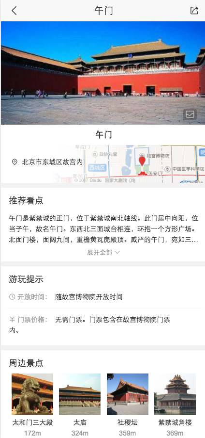

# 司文宇

> 从03.6-03.10

### 行程助手
- 背景：提供用户出行的所有信息，线上线下(短信)统一提供全方位服务。
- 收益：影响PV 暂无
- **工作量评估** 
 
  - 需求量：
  	9个情景页卡片
  - 开发风险：
  
	1.使用未沉淀的交互方式 | 1次 | 日历组件
	2.同时存在同步、异步更新方式 | 1次 | 提示信息，与短信同步
  
  - 沟通风险：
  
  	1.后端使用mini、gss等固定格式数据 | 1次 | 卡片多，多个资源方KV
	2.后端使用其他部门的在线接口 | 3次 | 天气图标，糯米，高铁订餐
 
- **完成情况** 

 	2月28日 需求评审两次次
	3月1日 资源方schema创建
	3月7、8日 卡片schema创建，静态卡片开发中；图标解决方案确定，日历组件修改中。
	
- 本周进展 

	卡片schema创建，静态卡片开发中
	图标解决方案确定，日历组件修改中。
	
- **排期计划**

    见[wiki](http://wiki.baidu.com/pages/viewpage.action?pageId=304744527)
    
- 效果图

	
	
	
### 情景页卡片迭代
- 背景：拼链接修改
- 收益：影响PV 暂无
- **工作量评估** 

	无
 
- **完成情况** 

 	已上线
	
- 本周进展 

	03-08上线
		
- **排期计划**

  无
    
- 效果图

	

## 其他

1. 毕业设计开始了，准备论文和项目。

2. 搭建linux下的nginx服务。

3. 继续done

 

