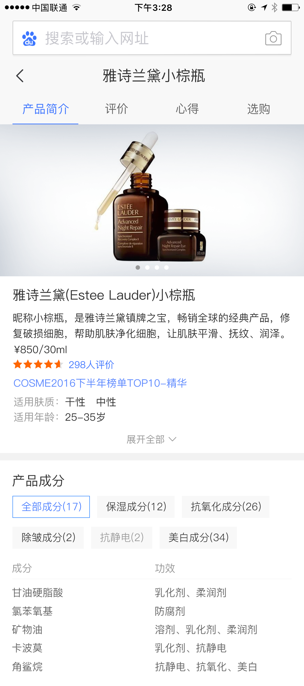
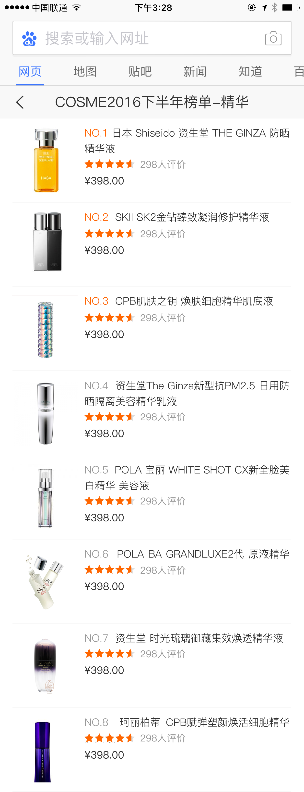

# 杨露

> 从2017-3-8到2016-3-10

#### 美妆一期（开发中）

- 背景：由于商品搜索结果对用户需求的满足不够好，现在用户已养成了去垂直的商品网站进行搜索+购物的习惯。希望引入优质的商品资源，全面地满足用户需求的同时，通过内容从消费决策阶段切入，培养用户来百度搜商品的习惯。目前美妆是仅次于3C的大占比领域，且未进行商品覆盖，因此选美妆商品进行实验。

- 收益：

- 工作量评估：
    - 美妆情景页
        - 基本信息卡，榜单情景页
        

- 本周进展：
    基本功能开发完成，剩余样式调优

- 排期计划：
    预计3月中前小流量上线
- 效果图：
    

    
    

#### 工作内容与计划 @杨露
- 本周工作内容
    - 两个情景页的样式调优
- 下周工作计划
    - 继续开发商品卡片，同时学习情景页的开发规范文档，提高自己的编码能力。