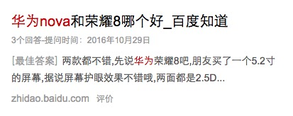
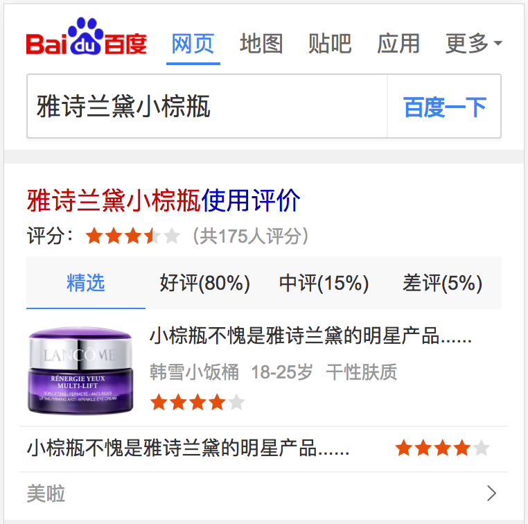
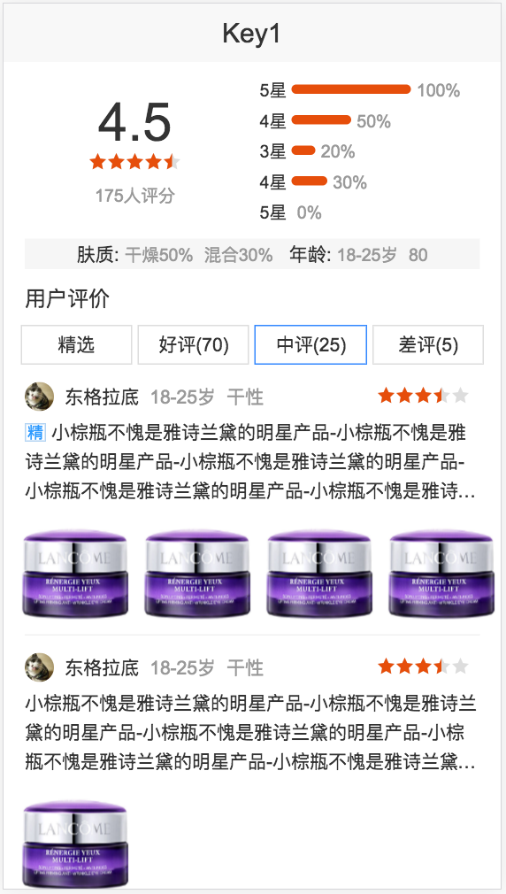

# 商品&游戏（陈锐,玲娟,键驰,仁广,杨露）

<style>
    .markdown-body img {
        border: 1px solid #888;
        box-shadow: 5px 5px 5px #888;
        width: 400px;
    }
</style>

> 从2017-3-6到2016-3-10

## 后续人员安排
```
商品：陈锐，杨露，仁广（0.5）
游戏：玲娟，键驰
运营：仁广（0.5）
```

- 根据组内工作休假情况可能会适当调整


## 问题CASE总结

- 本周无case


## 商品垂类

#### 美妆一期（开发中）

- 背景：由于商品搜索结果对用户需求的满足不够好，现在用户已养成了去垂直的商品网站进行搜索+购物的习惯。希望引入优质的商品资源，全面地满足用户需求的同时，通过内容从消费决策阶段切入，培养用户来百度搜商品的习惯。目前美妆是仅次于3C的大占比领域，且未进行商品覆盖，因此选美妆商品进行实验。

- 收益：

- 工作量评估：
    - 美妆结果页
        - 基本信息卡：DONE（待上线）
        - 评价卡：2day
        - 文章卡: 1day
        - 购买卡：1day
    - 美妆情景页
        - 基本信息卡：DONE（待上线）
        - 榜单排行卡：DONE（待上线）
        - 口碑评价卡：5day
        - 产品文章卡：3day
        - 商品选购卡：4day

- 本周进展：
    - 本周一（3.13）提测基本信息卡+情景页
    - 本周二（3.14）确定评价卡的schema格式
    - 本周三（3.15）完成通用文章卡+通用购买的前端样式开发
    - 本周五（3.17）完成基本信息卡+情景页功能优化和bug修复

- 排期计划：
    - 美妆基本信息+榜单卡片，预计下周一（3.20）上线
    - 美妆评价卡，预计下周二（3.21）提测，下周四（3.23）上线
    - 通用文章卡+通用购买卡，预计下周二（3.21）完成开发联调，下周三（3.24）上线

- 效果图：

<div>
    
    
    
</div>

#### 3C&家电一期（开发中）

- 背景：由于商品搜索结果对用户需求的满足不够好，现在用户已养成了去垂直的商品网站进行搜索+购物的习惯。希望引入优质的商品资源，全面地满足用户需求的同时，通过内容从消费决策阶段切入，培养用户来百度搜商品的习惯。

- 收益：预计覆盖600w pv

- 工作量评估：
    - 跳转原站链接改VIP链接：DONE
    - 3C详情卡+聚合情景页：待排

- 本周进展：
    - 本周四（3.16）上线原始链接改VIP链接

- 排期计划：
    - 3C详情卡+聚合情景页：3.20开始

- 效果图：

<div>
    
    
</div>
<div>
    
</div>


## 直播

## 游戏直播

* 背景：直播作为一种快速发展的新媒体形式，无论是数量上、内容上，都在极度扩张，而搜索对直播这类新内容的掌控力较弱。以搜索做入口，可以去聚合多家平台内容，满足并激发用户观看游戏&娱乐直播需求。

* 收益：全量pv 400w

* 工作量评估

    * 需求量：新增4个情景页，1个结果页

    * 风险：资源方接入合作页，可能涉及到fe的沟通成本和开发联调工作。按照之前fe的经验，接入一个资源方时间为0.5天或者2周都有可能。

* 完成情况

    * 3.1需求评审

    * 3.3给到UE终稿

    * 3.16联调，fe8天工作量

    * 预计3.23上线

    * --------------------

    * UE稿delay到3.8给全

    * 3.16联调

    * 预计3.24上线

* 效果图:


## 游戏垂类技术迁移

### 需求背景

1、由于前端业务交接，由多模团队交接回大搜团队，旧机制建立在商业知心框架上，迁移后从维护和新需求开发上，都有较大的长期成本和限制；
2、迁移至SF机制，用户体验有较大提升，整体基调和搜索更加吻合。

### 收益

影响PV 50-100W


### 工作量评估

* 需求量

    * 1个情景页卡片迁移到aladdin平台
    以哥伦布形式展现模板，分成多个子卡
    暂定4个schema
    有多个tab项存在无限下拉
    待定重新搜索功能

### 完成情况

暂无

### 本周进展

本周已产出schema，由于直播优先级比较高，rd先给直播出数据，游戏先hold，下周预计用假数据开发一部分模板

### 排期计划

* 具体排期现在待定，fe排期暂定10个工作日，加上搜索功能12~13个工作日
* 联调3~5天
* 提测2天左右

### 效果图


## 高级感项目

### 需求背景

百度wise搜索结果页的样式不够美观，阅读体验较差，现在尝试类App的设计风格，通过增大间距、放大图片、调整链接颜色等方式来增强浏览体验。

### 收益

    tieba2 影响PV 200w

    www_zhidao_normal 影响PV 6kw

### 工作量评估

* 需求量

整体颜色、间距等样式调整，在pmd.css中调整，模板不需要关心。对于涉及到模板结构改动的样式（3n->4n, 位置调整），在模板中将该部分单独抽出来，放到独立的tpl文件中，需要针对线上样式和实验样式各抽一个tpl，在iphone.tpl中include引入，通过$pageData.isNewUx的值来选择需要include的tpl

### 完成情况

已修改两个模板

### 本周进展

`tieba2` `www_zhidao_normal`已结构已修改完毕

### 排期计划

* 知道：5个模板，5人天工作量
* 贴吧：1个模板，1人天工作量




## 失重彩蛋（已完成）
- **背景**

    当用户在wise（或手百）端搜索"失重"时，在界面上展示出文字失重状态特效。目的是给用户以惊喜，增加百度移动端搜索的趣味性，提高用户体验；提高百度移动端搜索的自传播性，和用户黏性。

- **完成情况**

    - 03.06：上线
    - 03.06 - 03.08：持续追踪线上效果，及时修复已有问题

- **效果图**

<div>
    
</div>


## 商品垂类——美妆评论模块（开发中）
- **背景**

    由于商品搜索结果对用户需求的满足不够好，现在用户已养成了去垂直的商品网站进行搜索+购物的习惯。希望引入优质的商品资源，全面地满足用户需求的同时，通过内容从消费决策阶段切入，培养用户来百度搜商品的习惯。目前美妆是仅次于3C的大占比领域，且未进行商品覆盖，因此选美妆商品进行实验。我负责了其中的用户评论模块。

- **完成情况**

    - 03.08 - 03.09：出设计图
    - 03.09：编定Schema文件
    - 03.10：界面初稿

- **本周进展**

    拿到需求和设计界面，完成了Schema的设计，和搭建初步界面。预计下周完成联调。


## 同步PC端已有彩蛋至移动端（未开始）
- **背景**

    黑洞彩蛋和失重彩蛋在手百和wise端上线之后受到用户较好的评价，也引起了用户用手机搜索其他彩蛋的热情。故在近期加快了移动端彩蛋建设，第一步计划是将PC端已有彩蛋同步至移动端。

- **工作量评估**
    完成了对要同步的彩蛋的工作量评估：
    * Duang、摇一摇、抖动：预计开发时间1.5天，提测0.5天；共2天；
    * 淡入：预计开发时间1天，提测0.5天；共1.5天。
    * 旋转：预计开发时间1天，提测0.5天；共1.5天。
    * 翻转、翻转：预计开发时间1天，提测0.5天；共1.5天。
    * 跳跃：预计开发时间1天，提测0.5天；共1.5天。
    * 打雷，布谷鸟，大风：这三个同属于音效彩蛋，开发流程相似，故可以做一起开发。预计开发时间1天，提测1天；共2天。
    预计总共需要的开发时间为10个工作日。最快下下周四（3.23号）可以投入到具体开发中。


## PC端首页Logo改进计划（进行中）
- **背景**

    PC端百度首页节日Logo日益受到关注，针对在前几次项目中遇到的一些问题，项目组总结出以下三个有待解决的问题：
    - 逐帧高清支持
    - 分享
    - 扩大区域

    逐帧高清支持和分享功能涉及到开发；目前分享和扩大区域处于UE设计阶段；逐帧高清支持需要@雪冉支持。


## static-ui上线机制改造（未开始）
- **背景**

    鉴于在金刚狼彩蛋项目上线过程中遇到的问题（线下编译机器已无可用存储空间）打算对线下编译机器进行迁移；以及每次上线时间漫长的原因（20 - 30分钟），打算对上线机制进行改造 —— 用fis3进行增量编译来取代现有的PHP全量编译。

- **工作量评估**

    开发预计要2 - 3天；测试需要3 - 4天。预计下周四（3.16号）可投入到开发中。


## 美妆一期（开发中）

- 背景：由于商品搜索结果对用户需求的满足不够好，现在用户已养成了去垂直的商品网站进行搜索+购物的习惯。希望引入优质的商品资源，全面地满足用户需求的同时，通过内容从消费决策阶段切入，培养用户来百度搜商品的习惯。目前美妆是仅次于3C的大占比领域，且未进行商品覆盖，因此选美妆商品进行实验。

- 收益：

- 工作量评估：
    - 美妆情景页
        - 基本信息卡，榜单情景页


- 本周进展：
    基本功能开发完成，剩余样式调优

- 排期计划：
    预计3月中前小流量上线
- 效果图：

<div>
    
    
</div>


## 商品垂类——美妆评论模块（开发中）
- **背景**

    由于商品搜索结果对用户需求的满足不够好，现在用户已养成了去垂直的商品网站进行搜索+购物的习惯。希望引入优质的商品资源，全面地满足用户需求的同时，通过内容从消费决策阶段切入，培养用户来百度搜商品的习惯。目前美妆是仅次于3C的大占比领域，且未进行商品覆盖，因此选美妆商品进行实验。我负责了其中的用户评论模块。

- **完成情况**

    - 03.08 - 03.09：出设计图
    - 03.09：编定Schema文件
    - 03.10：界面初稿
    - 03.14：完成阿拉丁卡片界面
    - 03.17：完成情景页卡片界面

- **本周进展**

    不断细化需求，完善schema；完成了结果页和情景页卡片的界面编写。预计下周完成联调和提测。

- **效果图**
<div>
    
</div>
<br>
<div>
    
</div>

#### 商品美妆卡片 （项目状态:开发完成）
- 背景：由于商品搜索结果对用户需求的满足不够好，现在用户已养成了去垂直的商品网站进行搜索+购物的习惯。希望引入优质的商品资源，全面地满足用户需求的同时，通过内容从消费决策阶段切入，培养用户来百度搜商品的习惯。目前美妆是仅次于3C的大占比领域，且未进行商品覆盖，因此选美妆商品进行实验。

- 收益：实验8w pv 全量15w pv

- 工作量评估：
    - 美妆结果页
        - 基本信息卡
    - 美妆情景页
        - 基本信息卡
        - 榜单排行卡

- 本周进展：
    - 本周二（3.14）修改提测bug
    - 本周三（3.15）基本信息卡需求更改，新增功能开发
    - 本周四（3.16）开发基本完成，进行回测以及ue走查
- 排期计划：
    －预计下周一上线


- 效果图：
    
<div>
    
    
    
</div>