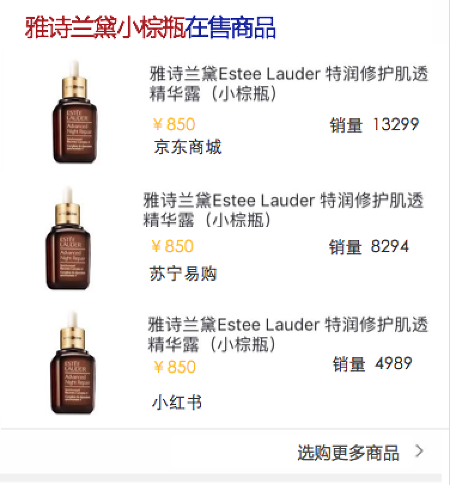
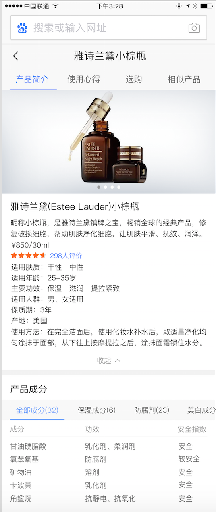
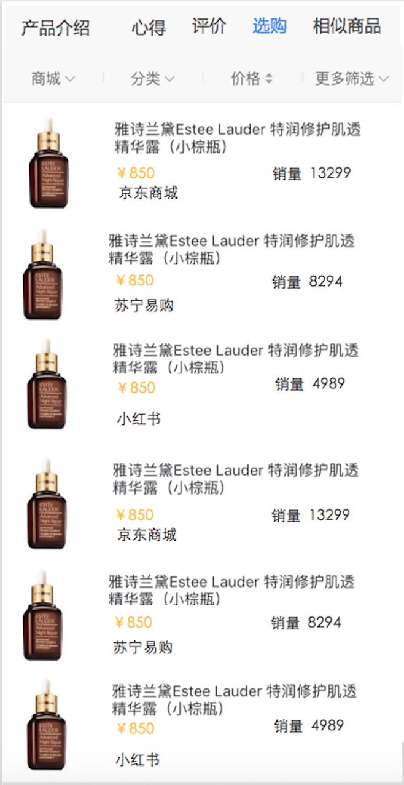
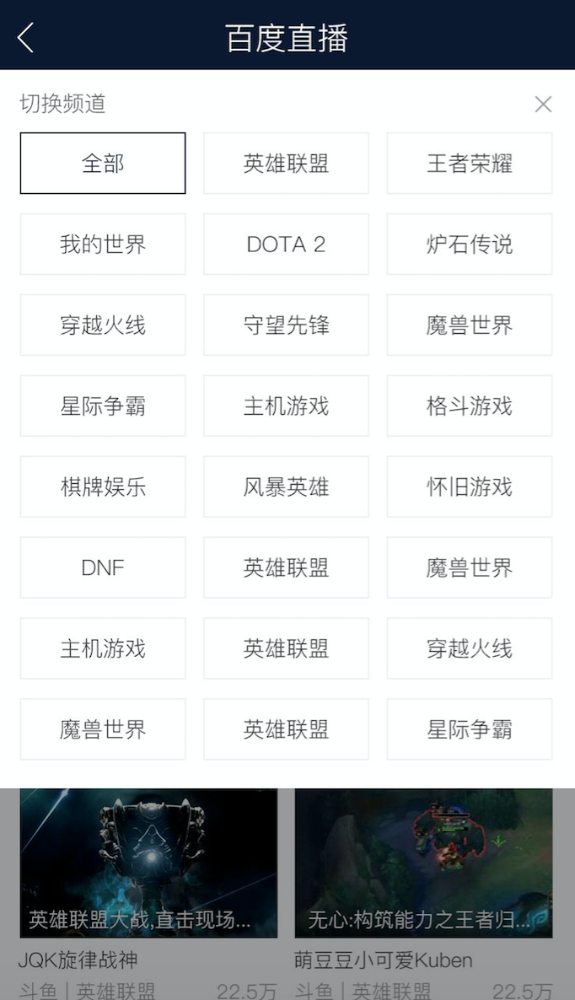

# 商品&游戏月报

> 从2017-2-17到2016-3-17

<style>
    .imglist img {
        border: 1px solid #888;
        box-shadow: 5px 5px 5px #888;
        width: 400px;
    }
</style>

## 项目人员安排
```
商品：陈锐，杨露，仁广（0.5）
游戏：玲娟，键驰
运营：仁广（0.5）
```

- 根据组内工作休假情况可能会适当调整


## 上线项目及收益

|  方向  |       项目            |  影响面  |  PV提升 |  预览地址 |
|---|---|---|---|
|  商品  | 商品资讯卡+情景页     |   15W    |   15W   | [地址](http://www.baidu.com) |
|  商品  | 商品情景页迁移SF2.0   |   80W    |         | [地址](https://m.baidu.com/ssid=22266368616e676a69616e636869df09/s?word=%E4%BA%AC%E4%B8%9C&ts=5662074&t_kt=0&ie=utf-8&rsv_iqid=3772307301&rsv_t=9088N2ZwAwVF3OlnNXPzS4lnsfaXU3O7fA76hZEbXhKjJUGB1f7x&sa=ihr_1&rsv_pq=3772307301&rsv_sug4=1832&ss=001) |
|  运营  | 金刚狼3               |    30W      |        |                              |
|  运营  | 黑洞                  |     1211W     |         |                              |
|  运营  | 失重                  |          |         |                              |


## 工作量及质量

|上线项目数|卡片数|紧急上线次数|修复BUG数量|
|---|---|---|---|
|5  |7  |2  |2  |

## 问题CASE总结

- 线上bug：2个
    - 时阿中间页scroll事件没有销毁，退出后进入其他情景页会继续出发滚动，2.17上线修复
    - 商品模板情景页1.0升级到2.0，新增act_goods模板。模板上线后，结果页跳转情景页的入口跳转失败，导致不能正常展现情景页的数据，已修复

## 重点项目和产出

#### 商品美妆一期（开发中）

- 背景：由于商品搜索结果对用户需求的满足不够好，现在用户已养成了去垂直的商品网站进行搜索+购物的习惯。希望引入优质的商品资源，全面地满足用户需求的同时，通过内容从消费决策阶段切入，培养用户来百度搜商品的习惯。目前美妆是仅次于3C的大占比领域，且未进行商品覆盖，因此选美妆商品进行实验。

- 收益：提高覆盖面，提升搜索pv

- 工作量评估：
    - 美妆结果页
        - 基本信息卡：DONE（待上线）
        - 评价卡：2day
        - 文章卡: 1day
        - 购买卡：1day
    - 美妆情景页
        - 基本信息卡：DONE（待上线）
        - 榜单排行卡：DONE（待上线）
        - 口碑评价卡：5day
        - 产品文章卡：3day
        - 商品选购卡：4day

- 完成情况：
    - 本周一（3.13）提测基本信息卡+情景页
    - 本周二（3.14）确定评价卡的schema格式
    - 本周三（3.15）完成通用文章卡+通用购买的前端样式开发
    - 本周五（3.17）完成基本信息卡+情景页功能优化和bug修复

- 效果图：

<div>
    
    
    
</div>

## 游戏直播（开发中）

* 背景：直播作为一种快速发展的新媒体形式，无论是数量上、内容上，都在极度扩张，而搜索对直播这类新内容的掌控力较弱。以搜索做入口，可以去聚合多家平台内容，满足并激发用户观看游戏&娱乐直播需求。

* 收益：全量pv 400w

* 工作量评估

    * 需求量：新增4个情景页，1个结果页

    * 风险：资源方接入合作页，可能涉及到fe的沟通成本和开发联调工作。按照之前fe的经验，接入一个资源方时间为0.5天或者2周都有可能。

* 完成情况

    * 3.1需求评审

    * 3.3给到UE终稿

    * 3.16联调，fe8天工作量

    * 预计3.23上线

    * --------------------

    * UE稿delay到3.8给全

    * 3.16联调

    * 预计3.24上线

* 效果图:

<div class="imglist">

    
    
    
    

</div>

## 游戏垂类技术迁移

### 需求背景

1、由于前端业务交接，由多模团队交接回大搜团队，旧机制建立在商业知心框架上，迁移后从维护和新需求开发上，都有较大的长期成本和限制；
2、迁移至SF机制，用户体验有较大提升，整体基调和搜索更加吻合。

### 收益

影响PV 50-100W


### 工作量评估

* 需求量

    * 1个情景页卡片迁移到aladdin平台
    以哥伦布形式展现模板，分成多个子卡
    暂定4个schema
    有多个tab项存在无限下拉
    待定重新搜索功能

### 完成情况

暂无

### 本周进展

本周已产出schema，由于直播优先级比较高，rd先给直播出数据，游戏先hold，下周预计用假数据开发一部分模板

### 排期计划

* 具体排期现在待定，fe排期暂定10个工作日，加上搜索功能12~13个工作日
* 联调3~5天
* 提测2天左右

### 效果图


<style>
    .markdown-body img {
        width: 375px;
        border: 1px solid #ccc;
        box-shadow: 5px 5px 5px #ccc;
        margin-left: 30px;
    }
</style>
