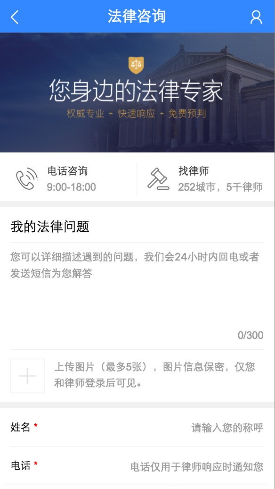
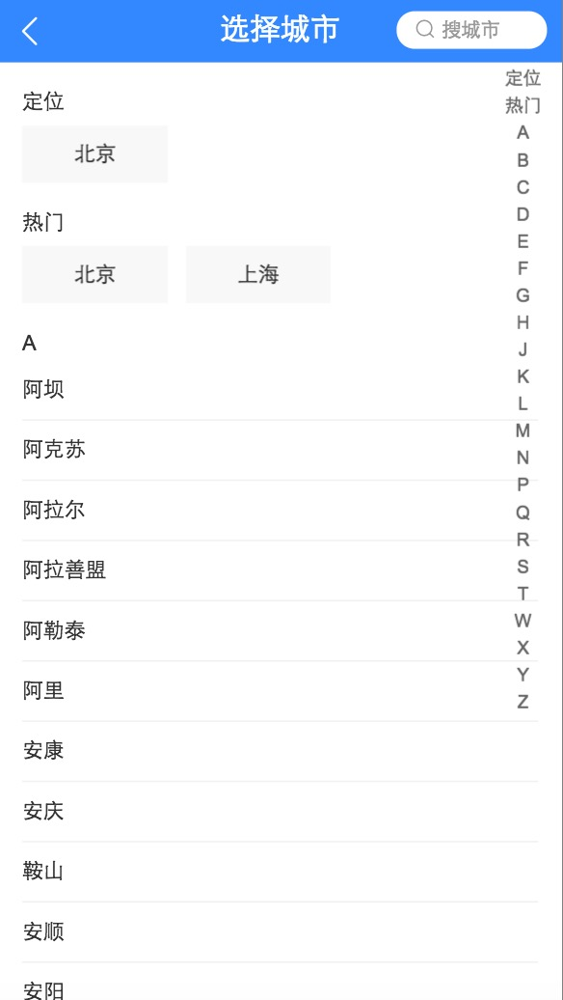

# 平台化方向周报

> 从2017-3-10到2016-3-17

## 人员安排
```
招聘B：张屾（0.5），刘玲玲
招聘站：冯斐帆
专家：胡晓卉
模板平台：张屾（0.5）
```

## 开放平台

#### 招聘to B （项目状态: 开发中） @张屾 @刘玲玲

- 背景
    * 通过企业接入的方式提升效率、职位真实性、核心竞争力和商业，同步思考一些小而新的模式创新尝试可能性。
- 工作量评估
    * 需求量 （4个pc 页面、其中共用部分拆分成13个组件）
        - 组件：header 、输入框 ＋ 校验器 、地区选择、多图上传、文本输入、通知对话框、下拉列表、组别单选、组别复选、搜索框、翻页、职位选择tree
        - pc页面：引导页、职位发布页、资质审核页、职位管理页
    * 开发风险
        - 上传文件实现难道较大
- 收益
	* 暂无 
- 完成情况（时间点达到的里程碑）
    * 引导页开发完成，资质审核页完成85%、职位管理完成 90%
- 本周进展
    * 资质审核页开发完成85%；
    * 职位管理完成 90%

- 效果图
    * 
    * 
    * 
    * 

- 下周计划
	* 完善资质审核页 和 职位管理90%
     
#### 数据开放平台 （项目状态：评审中） @张屾
          
- 背景：开放平台为检索提供深度优化的引入资源。新的前端技术选型应用在延伸到整个开放平台。

- 预期收益：
    - 未数据提供方提供更好的接入流程体验
    - 为检索提供更优质的数据资源
    - 简化统一前端开发

- **工作量评估** 
    - 需求量：
        - 数据开放平台
        - 个人中心
    - 开发风险：
        - 暂无
        
- **完成情况** 
    - 0%
    
- **排期计划** 
    - 3.10~3.17 产品评审产出mrd 
    - 3.19~3.24 ue出设计稿
     
## 专家平台

#### 专家平台-快速问诊-图文-用户端体验迭代（项目状态: 已上线）

- 背景：医疗垂类的互联网存量资源无法深度解决用户个性化/刚需问题，为满足用户需求，引入专业医生为用户进行解答；同时沉淀医生解决方案，反哺搜索。

- 预期收益：
 - 减少用户跳出率
 
- **工作量评估** 
  - 需求量：
    1个页面样式迭代
    
  - 开发风险：
     - 使用未沉淀的交互方式 | 1次 | 进入页面时用户提问数滚动效果
     
  - 沟通风险：
     - 背景图片问题 | 1次 | 因数字需要决定定位，对背景图有一定要求
     
- **完成情况** 
     - 3月13日~3月14日 
     - 3月15日 走查、测试
     - 3月16日 上线
     
- 本周进展 
	 - 开发、跟测、上线。
	 
- **排期计划**
	 - 3月13日~3月14日 
     - 3月15日 走查、测试
     - 3月16日 上线
	 
- 效果

  [预览](https://m.baidu.com/zhuanjia/question#/submit?vn=med)
    <table>
        <tr>
            <td>
                
            </td>
        </tr>
    </table>
    
#### 专家问答-法律二期支付(开发中)

- 背景：平台一期实现了最小功能闭环上线后，二期进行功能优化，包括优化细化问题页面的用户体验、支付功能等。

- 预期收益：
 - 二期整体目标
     - 1、	进一步丰满医疗&法律的平台功能：付费，专家咨询/问诊
     - 2、	百度专家品牌稳定感知：平台固定入口

- **工作量评估** 
  - 本次需求量：
 	 - 1个新增页面
 	 - 3个页面调整
  
  - 开发风险：
     - 兼容 | 1次 | 两个已有页面调整需要对旧订单作兼容，样式、字段区别较大

  - 沟通风险：
     - 沟通 | 1次 | 字段状态很多，样式根据不同字段内容共同确定，mrd稿和设计稿没有列出全部状态，一些细节待沟通

- 完成情况

    - 03-17 介入开发

- **排期计划**
	 - 03-17~03-24 开发
     - 03-27~03-28 联调

#### 专家平台-315运营 （项目状态: 开入口）

- 背景：百度搜索16年年底自建法律平台页面，引入行业专家，为用户提供除网络现有免费资源外更专业的服务。为提升产品影响力和知名度，在2017年3月15日-16日通过时效性大卡固定Tab位+feed流的形式，在搜索结果页、百家号及wise结果页底部浮层、微博等渠道展开宣传运营活动，解决用户在315期间维权搜索上的时效性刚需&个性化问题解答。

- 预期收益：
 - 为百家号带来5w阅读；百度专家内容页总PV过10w；
 - 整体PV及用户提问数增长，达到平台目前以来日均峰值；
 - 满足用户时效性需求，优化315检索体验；
 
- **工作量评估** 
  - 需求量：
    2个新页面，1个已有页面
    
  - 开发风险：
     - 使用未沉淀的交互方式 | 2次 | 内容提交页banner定时滚动、横滑切换；分享组件解耦
     - 同时存在同步、异步更新方式 | 1次 | 带有动态参数的路径之间跳转的时候，由于会渲染同样的组件，因此组件实例会被复用，页面不会刷新。

  - 沟通风险：
     - 开发方案 | 1 次 | 文章内容的提交方式
     - 效果图定稿问题 | 3 次 | 提交页标注图周四给出；走查时调整终稿样式；banner图还需调整
     
- **完成情况** 
     - 2月27日~3月02日 整体开发完毕
     - 3月03日 联调，给出环境。
     - 3月07日~3月10日 跟测、配合样式和需求调整
     - 3月10日 上线
     - 3月14日 开流量
     
- 本周进展 
	 - 跟测、配合样式和需求调整、上线。
	 
- **排期计划**
	 - 2月27日~3月02日 开发
     - 3月03日 联调
     - 3月06日~3月07日 测试
	 - 3月08日 上线
	 
- 效果

	[预览](https://m.baidu.com/zhuanjia/question#/315/article?id=18)
    <table>
        <tr>
            <td>
                
            </td>
            <td>
                
            </td>
            <td>
                
            </td>
            <td>
                
            </td>
        </tr>
    </table>
    
#### 专家问答-法律二期(全量中)

- 背景：平台一期实现了最小功能闭环上线后，二期进行功能优化，包括优化细化问题页面的用户体验、支付功能等。

- **工作量评估** 
  - 本次需求量：
    1个功能调整

- 完成情况

    - 01-13 确定排期，介入开发。

    - 01-17 banner、春节节日公告上线。

    - 01-22 提交页带query的情况增加placeholder上线（根据ubs评估反馈调整页面，进行扩招）

    - 01-22 UE交付终稿，进入页面开发正常排期。

	- 02-08 联调。
    
    - 02-10 提测。

    - 02-16 以小流量方式上线二期模板，暂未开流量
    
    - 02-20 上线分享功能、用户信息安全相关处理、功能优化
    
    - 02-22 开小流量

    - 03-14 全量
 
    
- 效果

  [预览](https://m.baidu.com/zhuanjia/question#/submit?vn=law&ref=aladdin1)
  
     <table>
        <tr>
            <td>
                
            </td>
            <td>
                
            </td>
            <td>
                
            </td>
            <td>
                
            </td>
            <td>
                
            </td>
        </tr>
    </table>
  
	  
## 招聘

#### 百聘中间页收藏页和申请页开发 （项目状态: 开发完成100%，周五下班前上线）

- 背景：百度百聘pc端新增收藏页和申请页面，这样会修改全职招聘页面的申请逻辑，中间增加简历页面的填写过程。

- 收益：
 - 提高用户体验，增加pc端简历数量。
 
- **工作量评估** 
  - 需求量：
    pc端两个页面
    
  - 开发风险：
     - 上线后评估。

  - 沟通风险：
     - 无
     
- **完成情况** 
     - 周五下班前完成上线。
     
- 本周进展 
	 - 已经完成。
	 
- **排期计划**
	 - 根据线上问题反馈，进行优化
	 
- 效果(登录后可以浏览页面效果)
    pc： http://zhaopin.baidu.com
  
    
#### 百聘中间页pc端个人中心页面开发 （项目状态: 周五下班前上线）

- 背景：百度百聘本周进行了pc端个人中心页面的联调和测试。

- 收益：
 - 提高日均简历的收益。
 
- **工作量评估** 
  - 需求量：
    涉及pc端个人中心页面。
    
  - 开发风险：
     - 无。

  - 沟通风险：
     - 头像图片存储部分，目前rd后端还不能在短时间内支持，已经和pm沟通
     
- **完成情况** 
     - 周五下班前上线完成。
     
- 本周进展 
	 - 开发完成100%。
	 
- **排期计划**
	 - 下周根据反馈会适当调整
	 
- 效果(登录后可以浏览页面效果)
    pc：http://zhaopin.baidu.com


#### 百聘中间页wise端优化处理 （项目状态: 需求对接完毕）

- 背景：百度百聘本周进行了wise端页面优化部分的对接。

- 收益：
 - 提高用户体验。
 
- **工作量评估** 
  - 需求量：
    涉及wise端大约20+数量的页面。
    
  - 开发风险：
     - 每个页面的逻辑和优化点可能会冲突，发生向上报错。
     - 解决办法：1、上线前多测试几次。2、优化点过多，按照影响面大小，分批上线（大致分三批上线）。

  - 沟通风险：
     - 优化过程中，可能存在ue、pm、fe意见不统一的情况，增加沟通成本。
     - 解决办法：每周利用例会时间，集中沟通，保证优化正常进度。
     
- **完成情况** 
     - 这周初步和pm、ue进行了对接。
     
- 本周进展 
   - 需求对接。
   
- **排期计划**
   - 下周开发进行第一批优化点开发。
   
- 效果
    无  
    
## 模版开发平台

- 背景：模版开发平台的不断改进和优化。未来更加开放和提供定制化流程机制

- 预期收益：提供更稳定 更开发的开发方式

- **工作量评估** 
  - 需求量：
     - 优化git diff
     - cr不稳定原因追查及解决
     - 模版展现分析2017年数据丢失问题 @胡晓卉
     - 标准化js css代码的支持 @张屾
     - 接口开放
     
  - 开发风险：
     - 不能全人力投入
     - 临时被打断次数太多
     
- **完成情况** 
     - 0%
	 
- **排期计划**
	 - 3.17前 确定fecs在平台的一期支持
	 - 3.25前 完成fecs在平台上的一期实现
	 - 3.31前 上线一期fesc
	 - 3.31前 fix模版展现分析数据丢失问题

