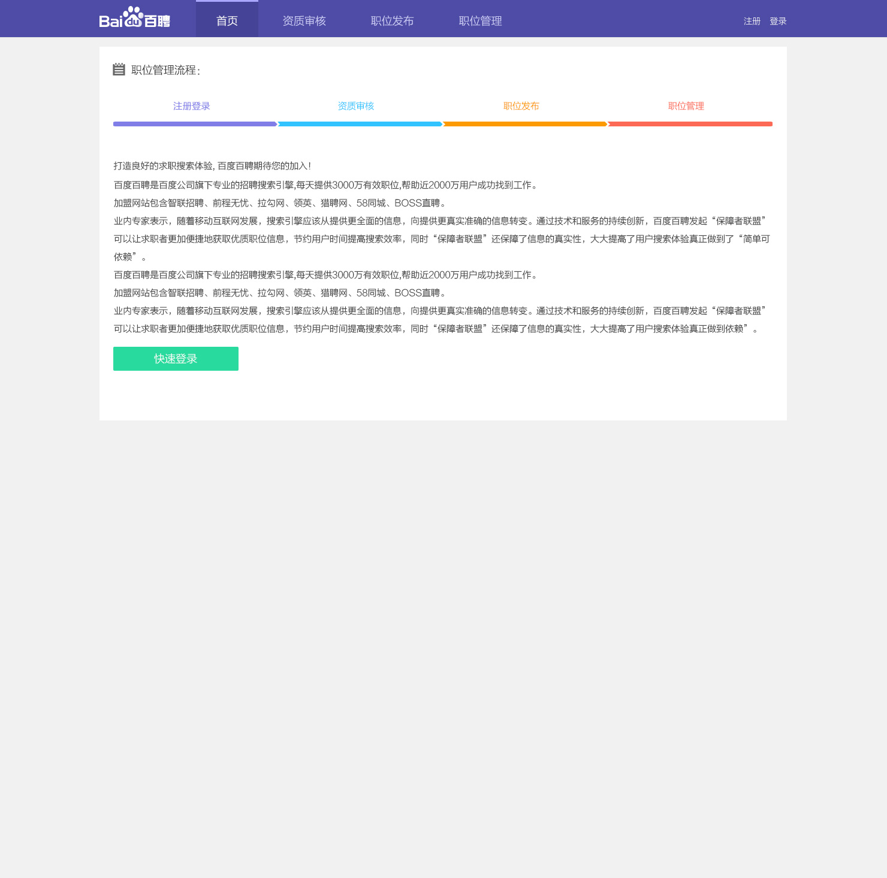
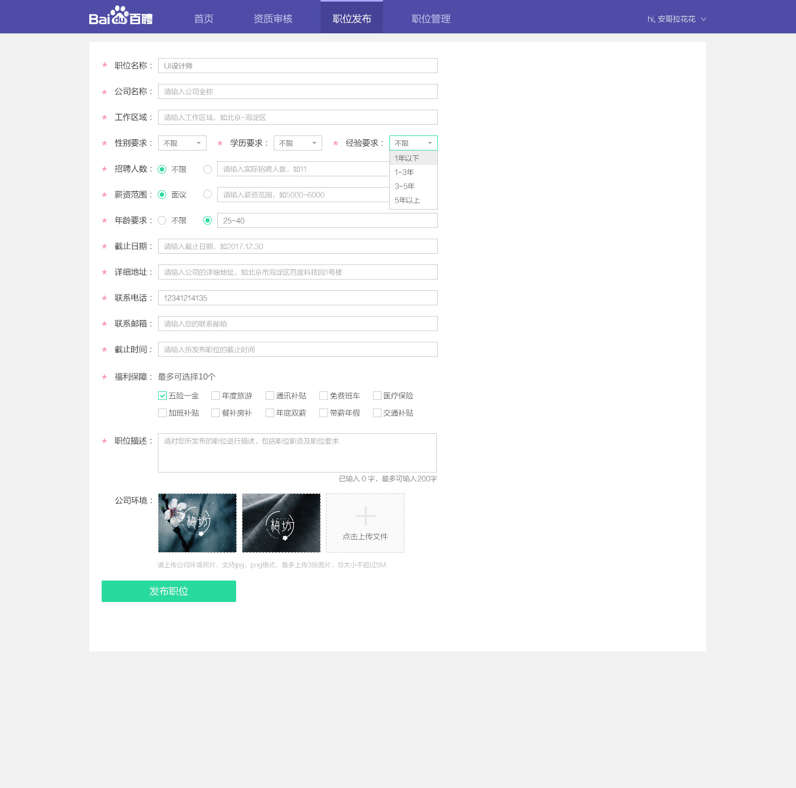
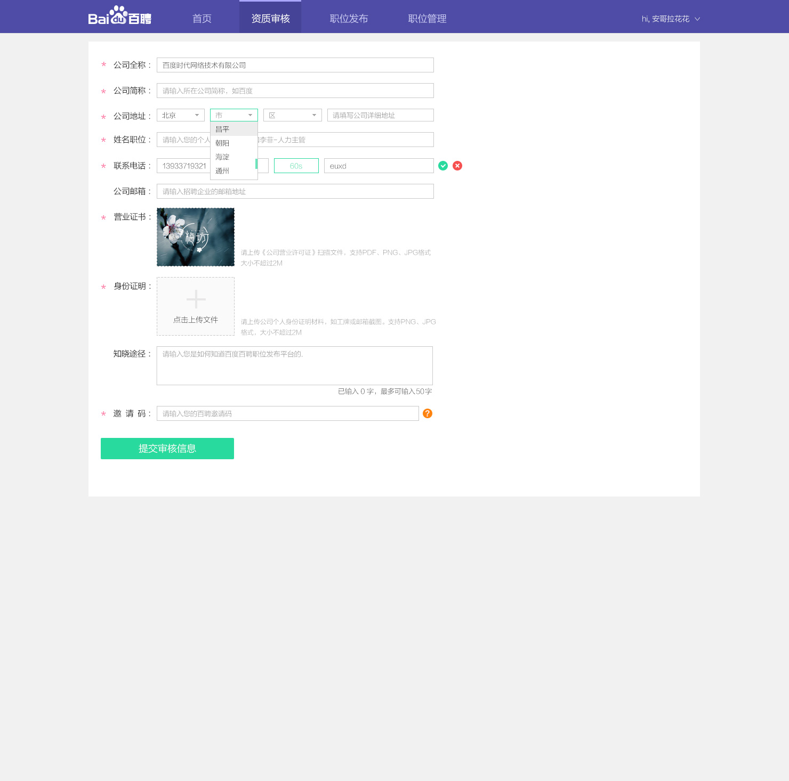
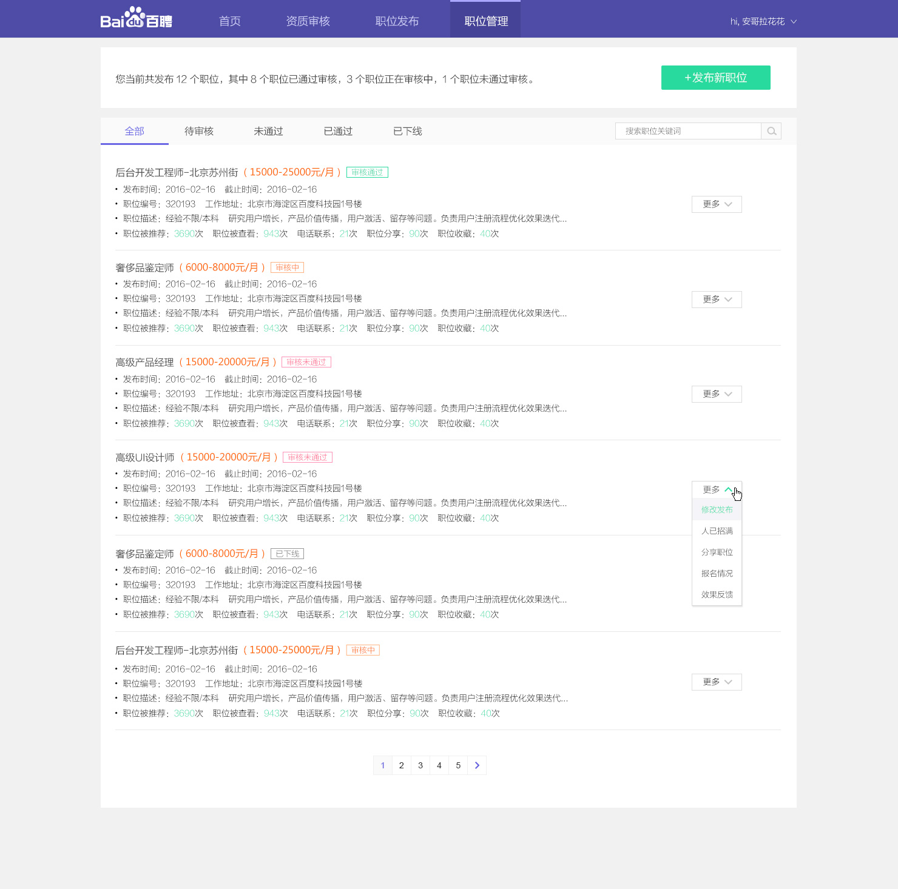

# 刘玲玲

> 2017-03-13 ~ 2017-03-17

#### 招聘B端-(熟悉vue框架中，尝试开发引导页)
- 背景
    * 通过企业接入的方式提升效率、职位真实性、核心竞争力和商业，同步思考一些小而新的模式创新尝试可能性。
- 工作量评估
    * 需求量 （4个pc 页面、其中共用部分拆分成13个组件）
        - 组件：header 、输入框 ＋ 校验器 、地区选择、多图上传、文本输入、通知对话框、下拉列表、组别单选、组别复选、搜索框、翻页、职位选择tree
        - pc页面：引导页、职位发布页、资质审核页、职位管理页
    * 开发风险
        - 上传文件实现难道较大
- 收益
	* 暂无 
- 完成情况（时间点达到的里程碑）
    * 引导页开发完成，资质审核页完成85%、职位管理完成 90%
- 本周进展
    * 资质审核页开发完成85%；
    * 职位管理完成 90%

- 效果图
    * 
    * 
    * 
    * 

- 下周计划
	* 完善资质审核页 和 职位管理90%