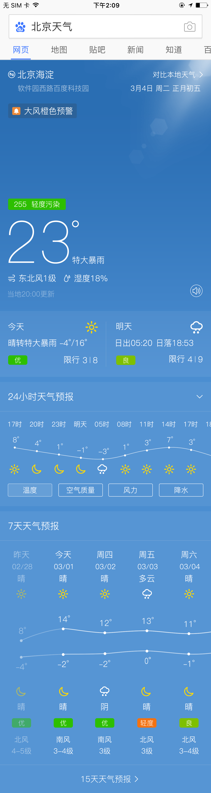
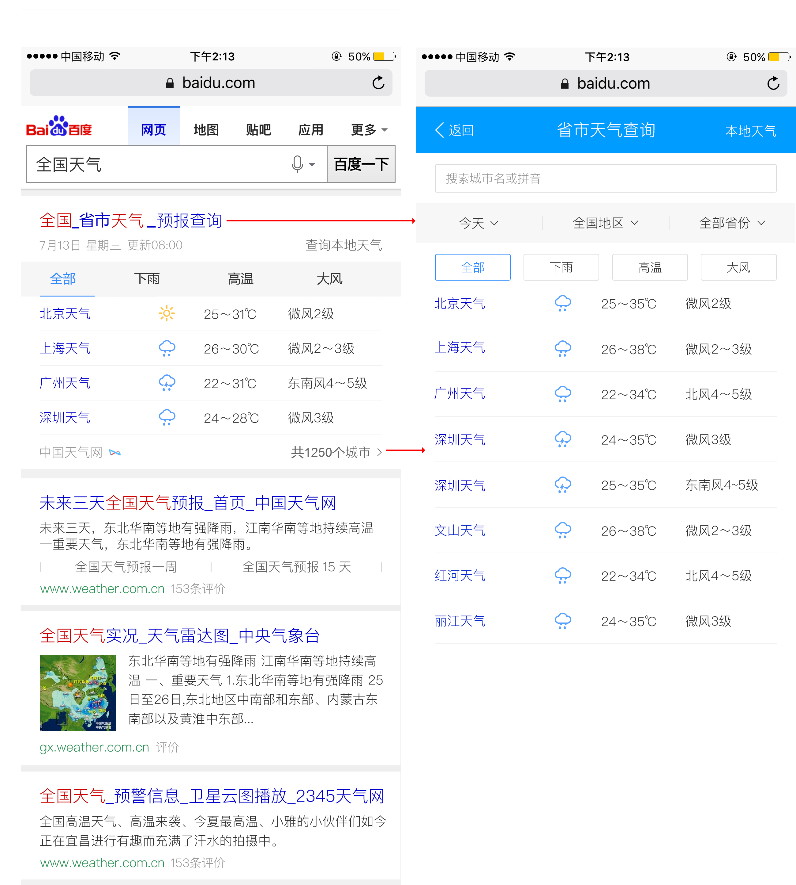
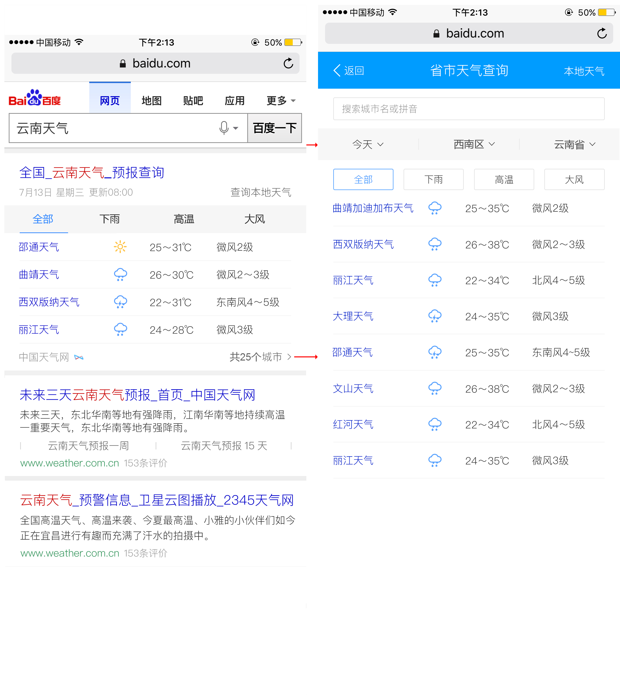
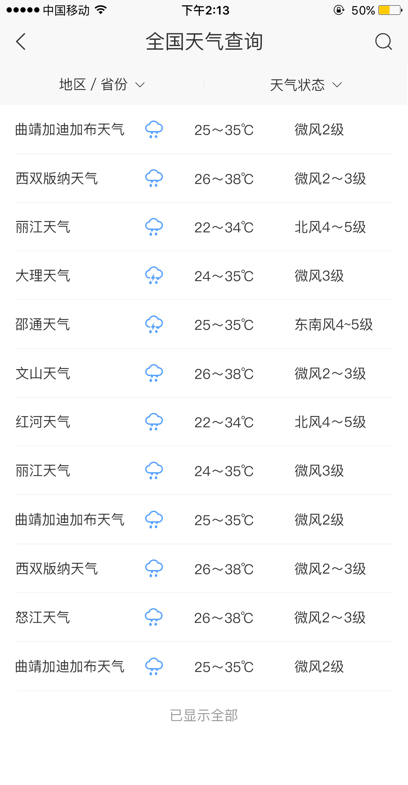
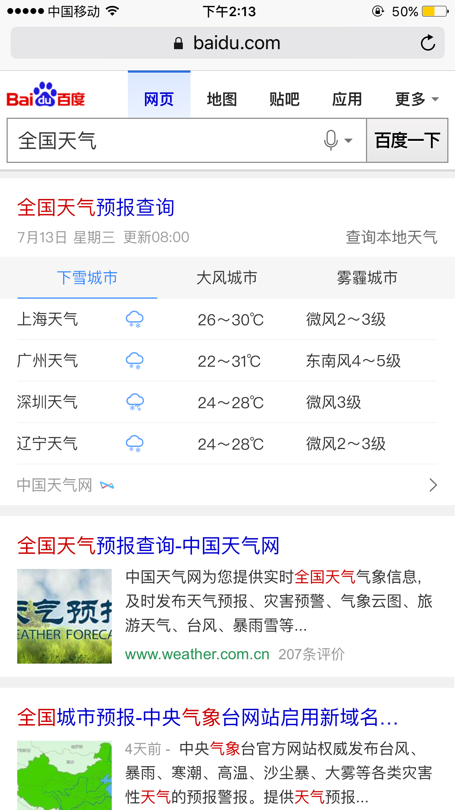

# 肖学林
> 2017.3.13~2017.3.17

### 天气NA化 
- 背景
  - 当前WISE端天气卡片，针对天气主需求部分仍存在可优化的空间：1、 首屏天气信息过多，用户无法一目了然的获取到各维度天气情况；2、 根据不同天气情况的背景色，特别是：阴天&多云的灰色，色调过重，颜色单一，用户感知体验较差；3、 24小时预报缺失风力、降水量、空气质量信息，未来天气预报缺失空气质量预报等信息；4、 对标APP竞品，交互上仍可进行优化。
- 需求量
  - 1个阿拉丁卡片
  - 开发风险，沟通风险：
    无
- 开发模板 aladdin: sg_weather_na
- 本周进展
  - 开发中

- 完成情况 
  - 暂无
- 排期计划
  - 3.14-3.17 开发
  - 预计3.20联调
- 效果图

### 天气泛需求

- 背景
  - 增加天气预报，地区，省份天气检索，可筛选全国处于XXX天气情况下的城市，满足用户更多的需求
- 影响面
  - 大约7.5W

- 本周进展
  - ue图调整
  - rd人员更换，排期调整
  - 情景页结果页开发完成
  - 2.27开始联调
  - 3.3qa测试
  - 3.6修改测试后的问题
  - 3.7人工评估
  - 小流量上线 [新疆天气](https://m.baidu.com/s?word=%E6%96%B0%E7%96%86%E5%A4%A9%E6%B0%94&sid=101473)

- 完成情况
  - 2.9结果页开发完成
  - 2.16根据调整后的ue图进行代码的修改
  - 2.21开发完成
  - 3.1联调完成
  - 3.3测试完成
  - 3.8人工评估完成
  
- 计划  
  - 1.17-1.20，2.10-2.13 开发
  - 2.14-2.16 联调
  - 2.17-2.20 测试
  - 2.21 人工评估
  - 2.22 三级单
  - 2.23 上线  
     调整后
  - 2.27-3.1联调
  - 3.2-3.3测试
  - 3.5 人工评估
  - 3.6 三级单
  - 3.7 上线 
- 效果图

新ue图

#### 工作内容与计划
##### 本周工作内容
  - 开发天气NA化。
  

