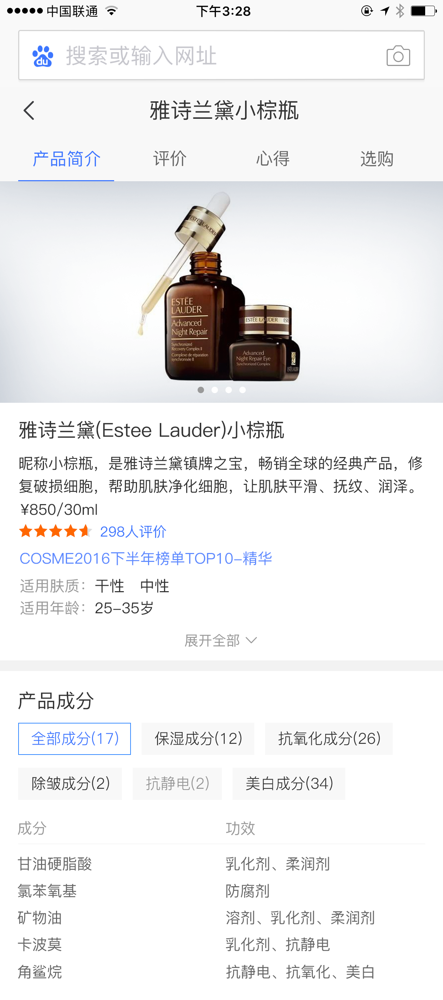
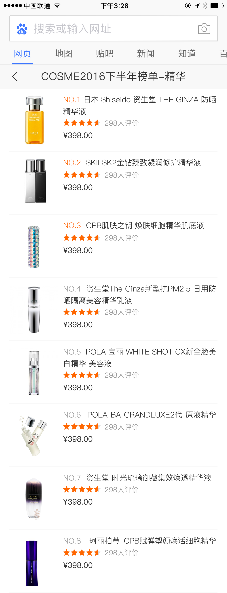
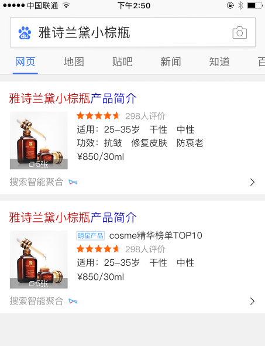

# 杨露

> 2017年3月13日~2017年3月17日

#### 商品美妆卡片 （项目状态:开发完成）
- 背景：由于商品搜索结果对用户需求的满足不够好，现在用户已养成了去垂直的商品网站进行搜索+购物的习惯。希望引入优质的商品资源，全面地满足用户需求的同时，通过内容从消费决策阶段切入，培养用户来百度搜商品的习惯。目前美妆是仅次于3C的大占比领域，且未进行商品覆盖，因此选美妆商品进行实验。

- 收益：实验8w pv 全量15w pv

- 工作量评估：
    - 美妆结果页
        - 基本信息卡
    - 美妆情景页
        - 基本信息卡
        - 榜单排行卡

- 本周进展：
    - 本周二（3.14）修改提测bug
    - 本周三（3.15）基本信息卡需求更改，新增功能开发
    - 本周四（3.16）开发基本完成，进行回测以及ue走查
- 排期计划：
    －预计下周一（3.20）上线

- 效果图：
    

    
    
    

