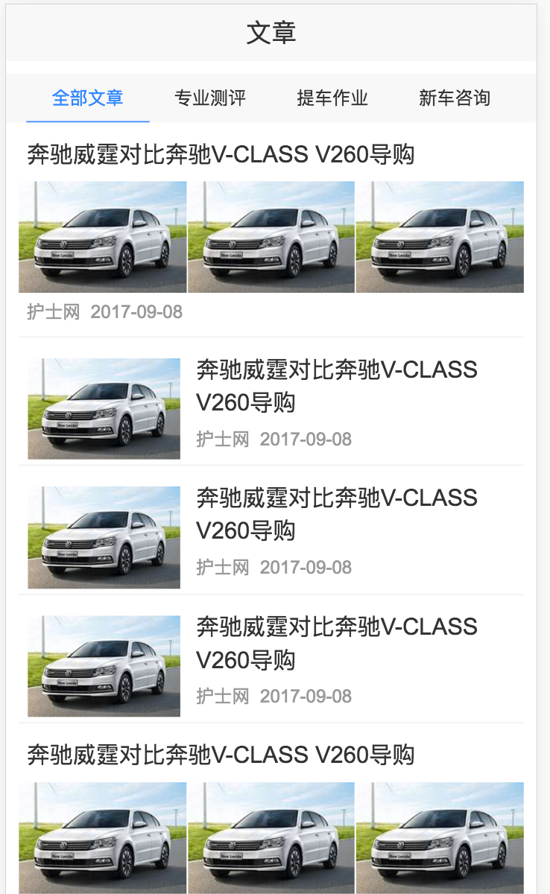
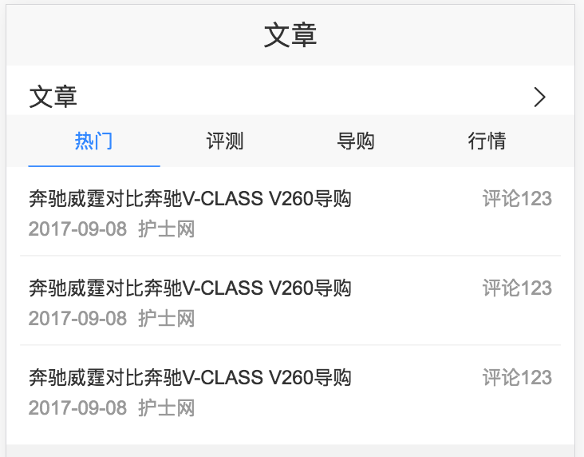
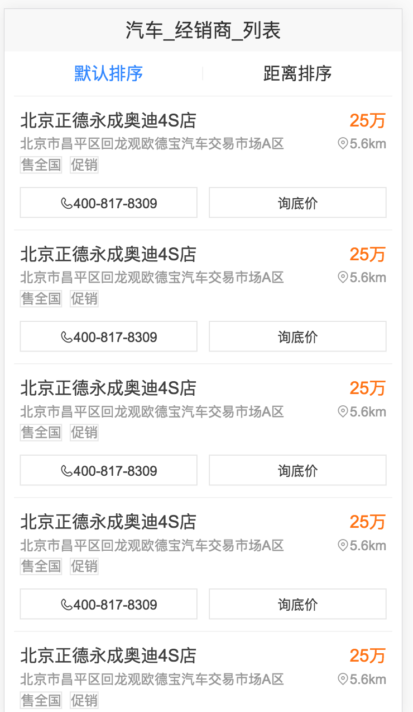

# 杨奇

> 2017年3月10日~2017年3月17日

#### 汽车项目 （项目状态:开发完成） @ 杨奇 
- 背景：本项目是满足搜索上新车部分的需求，重点满足用户选车的需求。 影响选车的决策因素很多，主要有：配置、报价、口碑、评测（文章、视频）等。从query分析可看出，选车需求的用户的TOP QUERY为车系词、品牌词以及泛需求词。
- 收益：影响PV 970w 
- **工作量评估** 
  - 需求量：
  2个情景页list卡片，1个情景页小卡
  - 开发风险：
     - 情景页同时需要用同步获取数据和异步获取数据
  - 沟通风险：
     - 文章，经销商情景页数据rd还没给出，先自定的schema
     - 文章，经销商的异步数据rd未给出，联调时才能给出
- **完成情况** 
	 - 3月13日 开始开发
   - 3月17日 开发完毕
- 本周进展 
	 - 完成了文章情景页list卡片和文章情景页小卡片的开发
   - 经销商情景页list基本开发完成
- **排期计划**
	 - 3月末  和rd联调
- 效果图
    

    

    

	

