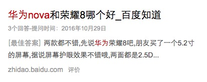
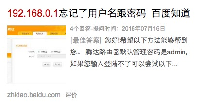
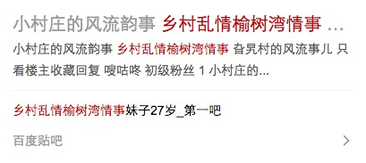
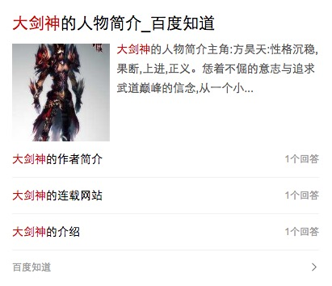
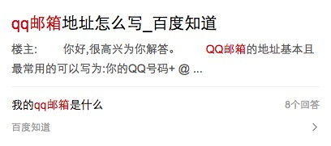

# 常健驰

> 从2017-3-20到2017-3-24

## 游戏垂类技术迁移

### 需求背景

1、由于前端业务交接，由多模团队交接回大搜团队，旧机制建立在商业知心框架上，迁移后从维护和新需求开发上，都有较大的长期成本和限制；
2、迁移至SF机制，用户体验有较大提升，整体基调和搜索更加吻合。

### 收益

影响PV 50-100W

### 工作量评估

* 需求量

    * 1个情景页卡片迁移到aladdin平台
    以哥伦布形式展现模板，分成多个子卡
    暂定4个schema
    有多个tab项存在无限下拉
    待定重新搜索功能

### 完成情况

已产出schema，由于直播优先级比较高，rd先给直播出数据，游戏先hold，下周预计用假数据开发一部分模板

### 本周进展

攻略、视频、英雄、资讯页面已开发完成，正在开发下载页面，目前还是假数据开发，等待rd的介入

### 排期计划

* 具体排期现在待定，fe排期暂定10个工作日，加上搜索功能12~13个工作日
* 联调3~5天
* 提测2天左右

### 效果图

## 高级感项目

### 需求背景

百度wise搜索结果页的样式不够美观，阅读体验较差，现在尝试类App的设计风格，通过增大间距、放大图片、调整链接颜色等方式来增强浏览体验。

### 收益

    tieba2 影响PV 200w

    www_zhidao_normal 影响PV 6kw

    zhidao 影响PV 4kw

### 工作量评估

* 需求量

整体颜色、间距等样式调整，在pmd.css中调整，模板不需要关心。对于涉及到模板结构改动的样式（3n->4n, 位置调整），在模板中将该部分单独抽出来，放到独立的tpl文件中，需要针对线上样式和实验样式各抽一个tpl，在iphone.tpl中include引入，通过$pageData.isNewUx的值来选择需要include的tpl

### 完成情况

高级感模板已修改完毕

### 本周进展

`tieba2` `www_zhidao_normal` `zhidao` 已改完

### 排期计划

* 知道：5个模板，5人天工作量
* 贴吧：1个模板，1人天工作量

