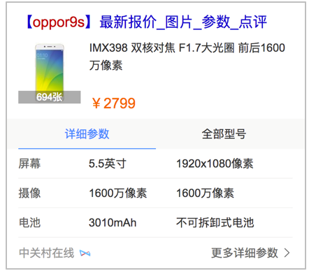
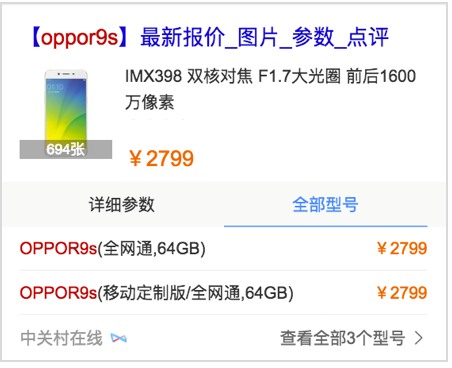
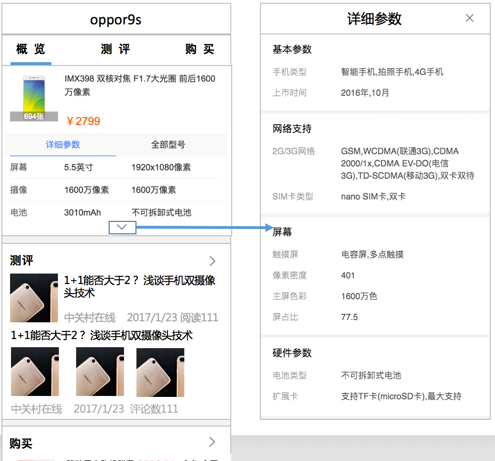

# 陈锐

> 从2017-3-20到2016-3-24

## 后续人员安排
```
商品：陈锐，杨露，仁广（0.5）
游戏：玲娟，键驰
运营：仁广（0.5）
```

- 根据组内工作休假情况可能会适当调整


## 问题CASE总结

- 线上3c卡片添加vip跳转链接后，点击中关村在线的资源链接会跳转error页
    - 问题原因：vip和中关村在线未打通，仍强行走vip跳转就跳转到error页
    - 修复方案：vip链接策略从前端下掉，改为后端处理vip链接


## 商品垂类

#### 美妆一期（开发中）

- 背景：由于商品搜索结果对用户需求的满足不够好，现在用户已养成了去垂直的商品网站进行搜索+购物的习惯。希望引入优质的商品资源，全面地满足用户需求的同时，通过内容从消费决策阶段切入，培养用户来百度搜商品的习惯。目前美妆是仅次于3C的大占比领域，且未进行商品覆盖，因此选美妆商品进行实验。

- 收益：

- 工作量评估：
    - 美妆结果页
        - 基本信息卡：DONE (已上线)
        - 评价卡    ：DONE (待上线)
        - 文章卡    : 1day
        - 购买卡    ：1day
    - 美妆情景页
        - 基本信息卡：DONE (已上线)
        - 榜单排行卡：DONE (已上线)
        - 口碑评价卡：DONE (待上线)
        - 产品文章卡：2day
        - 商品购买卡：4day

- 本周进展：
    - 本周四（3.23）提测口碑评价卡的结果页+情景页

- 排期计划：
    - 文章卡：下周一（3.27）开始开发联调 
    - 购买卡：下周一（3.27）开始开发联调

- 效果图：
    
<div>
    
    
    
</div>

#### 3C&家电一期（开发中）

- 背景：由于商品搜索结果对用户需求的满足不够好，现在用户已养成了去垂直的商品网站进行搜索+购物的习惯。希望引入优质的商品资源，全面地满足用户需求的同时，通过内容从消费决策阶段切入，培养用户来百度搜商品的习惯。

- 收益：预计覆盖600w pv

- 工作量评估：
    - 跳转原站链接改VIP链接：DONE
    - 3c结果页
        - 基本信息卡：DONE (待测试)
    - 3c情景页
        - 基本信息卡：DONE (待测试)
        - 多机型卡  ：DONE (待测试)
        - 参数详情卡：DONE (待测试)
        - 图片集合卡：2day

- 本周进展：
    - 本周一（3.20）完成信息卡、多机型卡、参数详情卡的schema建设
    - 本周四（3.28）完成信息卡、多机型卡、参数详情卡的前端开发工作
    - 本周五（3.28）开始联调数据

- 排期计划：
    - 信息卡、多机型卡、参数详情卡：预计下周一（3.27）提测
    - 图片集合卡：预计下周二（3.28）完成开发

- 效果图：
    
<div>
    
    
</div>
<div>
    
</div>

#### 商品资讯卡（已完成）


## 游戏垂类

#### 直播聚合（开发中）

#### 游戏中间页迁移（开发中）


## 运营

#### 通用运营机制（开发中）

- 工作量评估：
    - 召回机制：DONE (mis配送)
    - 运行机制：DONE (动态脚本)
    - 上线机制：5day (编译机器迁移，编译脚本改fis3)


