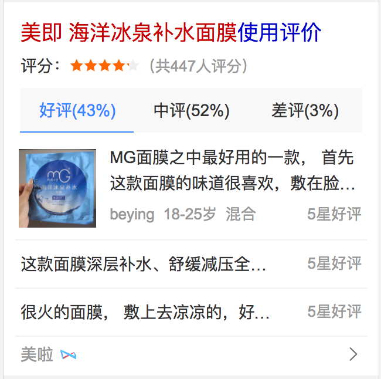
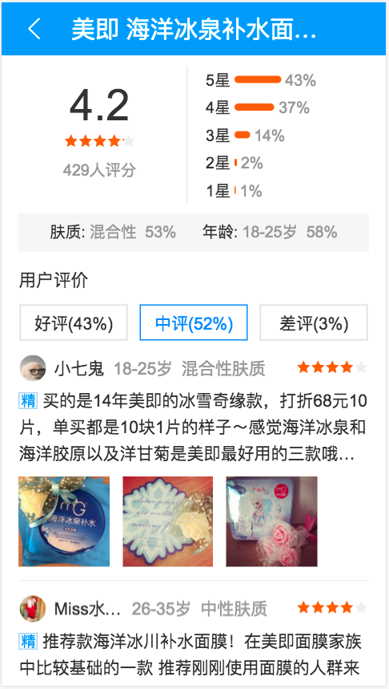

# 董仁广

> 2017.03.20 - 2017.03.24

## 商品垂类——美妆评论模块（已提测）
- **背景**

    由于商品搜索结果对用户需求的满足不够好，现在用户已养成了去垂直的商品网站进行搜索+购物的习惯。希望引入优质的商品资源，全面地满足用户需求的同时，通过内容从消费决策阶段切入，培养用户来百度搜商品的习惯。目前美妆是仅次于3C的大占比领域，且未进行商品覆盖，因此选美妆商品进行实验。我负责了其中的用户评论模块。

- **完成情况**

    - 03.08 - 03.09：出设计图
    - 03.09：编定Schema文件
    - 03.10：界面初稿
    - 03.14：完成阿拉丁卡片界面
    - 03.17：初步完成情景页卡片界面
    - 03.23：情景页完成联调和界面细节改造
    - 03.23 - 03.24：UE走查；提测

- **本周进展**

    不断明确需求，调整界面，完善schema；完成了情景页卡片的界面和联调；已提测；预计下周一前小流量上线。

- **效果图**

    

 

    

[预览地址](http://cp01-ps-fe-11.epc.baidu.com:8003/sf?pd=product_card&openapi=1&dspName=iphone&from_sf=1&resource_id=4512&group=33839&ie=utf-8&word=%E7%BE%8E%E5%8D%B3%20%E6%B5%B7%E6%B4%8B%E5%86%B0%E6%B3%89%E8%A1%A5%E6%B0%B4%E9%9D%A2%E8%86%9C&title=%E7%BE%8E%E5%8D%B3%20%E6%B5%B7%E6%B4%8B%E5%86%B0%E6%B3%89%E8%A1%A5%E6%B0%B4%E9%9D%A2%E8%86%9C&current=0&top=0&lid=5595197451873465633&ms=1&frsrcid=33840&frorder=3)

## 移动端运营彩蛋开发交接
- **背景**

    由于人力问题，移动端运营彩蛋相关项目交接给外包人员。

- **本周进展**

    外包人员已到位；本周进行了彩蛋开发相关的基本技术指导；预计下周指导其完成三个声效类彩蛋的开发以及上线。

## static-ui上线机制改造（开发中）
- **背景**

    鉴于在金刚狼彩蛋项目上线过程中遇到的问题（线下编译机器已无可用存储空间），现需对线下编译机器进行迁移；以及每次上线时间漫长的原因（20 - 30分钟），现需对上线机制进行改造 —— 用fis3进行增量编译来取代现有的PHP全量编译。

- **工作量评估**

    开发预计需要3天；测试需要3天。

- **本周进展**

    初步展开，正在确定方案中。预计下周五之前（2017.03.31）完成。
