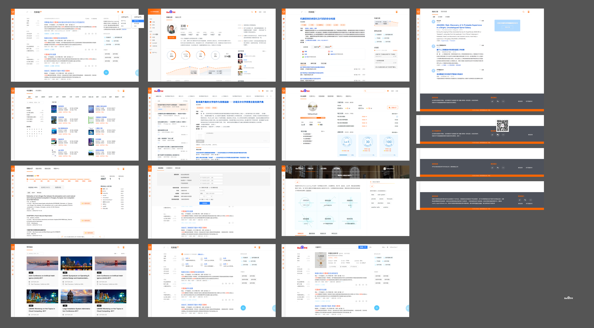

# 郭勇

> 从2017-03-20到2017-03-24

### 汽车

#### 汽车情景页 （开发中）

- 背景：汽车垂类后续将进行垂类自检，汽车相关卡片将不再跳转资源方，而是进入我们自己的多层情景页。目前一期项目主要满足用户选新车的需求，提供配置、报价、口碑、评测（文章、视频），图片等。后续会建设品牌阿拉丁、泛需求阿拉丁，并丰富频道页，全面满足选车需求。

- 收益：卡片预计覆盖pv 800w，情景页预计覆盖pv：700w

- **工作量评估** 
  - 需求量：7个情景页共涉及约15个情景页卡片
  - 开发风险：
     - 使用未沉淀的交互方式 | 3次 | 城市选择(需要通用解决方案)；车型/颜色筛选；图片放大(无法直接使用组件)
     - 同时存在同步、异步更新方式 | 多次 | 车型点击加载更多，报价口碑下拉展开等
  - 沟通风险：
     - 效果图定稿问题，UE和前后端同步开发，UE分批定稿
     - 后端使用mini固定格式数据，且后端和前端同步开发

- **完成情况** 
     - 2月8日 需求评审。
     - 2月20日 FE介入开发
    
- 本周进展 
     - 
本周指导@杨奇完成经销商详情、车型页面

     - 
本周fusion 组件 popup 和grouplist周一已上线

     - 
本周开始参数页面联调，预计下周提测参数页面

     - 
本周进行口碑列表和详情页面开发，预计下周三完成

     - 
到本周末除口碑2个页面，文章详情页，其他页面模板已经开放完成，将分页面联调

- **排期计划**
    - 指导杨奇进行卡片联调及后续送测。

    - 整体排期：
    [详见wiki](http://wiki.baidu.com/pages/viewpage.action?pageId=292265098)

- 效果图
    - [详见wiki](http://wiki.baidu.com/pages/viewpage.action?pageId=292719584)

### 学术
    
#### 学术整体UI3.0.2改版 (开发中)

- 背景：学术整体UI3.0.1上线已一段时间，基于线上效果和用户反馈，以及之前遗留通用问题，进行样式改版，统一全平台整体样式。

- 收益：统一学术搜索各页面风格，优化用户体验；

- **工作量评估** 
  - 需求量：学术搜索结果页涉及3个页面@郭勇负责，学术平台涉及13个页面(不含个人中心)@程恩负责
    
- 本周进展 

     - 
指导程恩进行学术平台修改本周已送测，周五或下周一上线

- **排期计划**
    - 3.14学术平台修改完成，可提测（delay2天）
    - 学术搜索结果页除高级搜索功能，汽车项目穿插进行，不按3.14时间点。

- 效果图
    - 

#### 论文助手接入大雅 (开发中)

- 背景：论文助手平台更多数据提供方希望接入，本周接入大雅。

- 收益：进一步提升品牌影响力，GMV；

- **工作量评估** 
  - 需求量：论文助手1个页面修改
    
- 本周进展 

     - 
本周五完成大雅接入前端修改，联调和确认，下周一上线

- **排期计划**
    - 下周一上线

- 效果图
    - 暂无