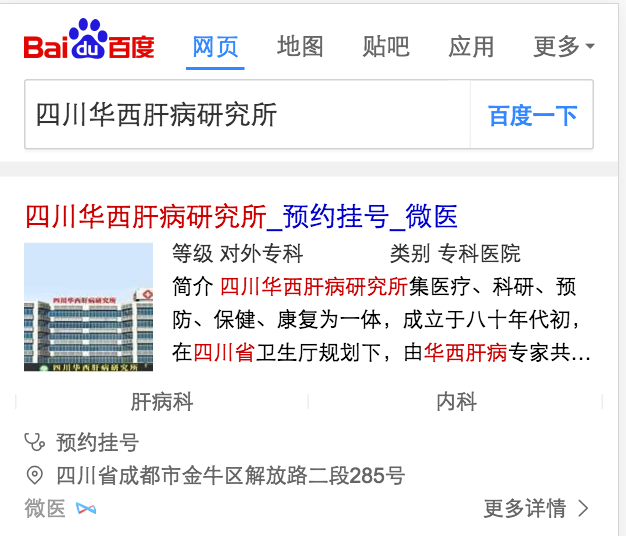
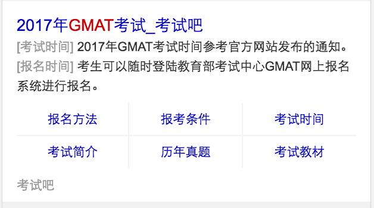

#### 医院@李金梅
- 背景：
  由于资源方数据改动，将必填字段改为不必填字段，需做数据兼容处理

- **完成情况**
   - 3.16     对wz_hospital_special模板做数据兼容处理 模板给ue走查样式
   - 3.17     wz_hospital_special模板ue走查样式&&提测
   - 3.20     wz_hospital_special模板上线
- 本周进展
   - 3.16     对wz_hospital_special模板做数据兼容处理完成
   - 3.17     wz_hospital_special模板ue走查样式&&提测通过
   - 3.20     wz_hospital_special模板上线完成
- **效果图**
  - wz_hospital_special
    
 
### 未删格化模版优化@李金梅
- 背景：针对未栅格化的模板，以新版UE图进行栅格化
- 收益&目标：该模板会通用normal_link,pc,wise,ipad端公用模板。因线上case发现未线上老旧模板，未栅格化
- 开发模板
	- 情景页：accountant_exam
- **完成情况**
    - schema数据格式开发 
    - base模板开发完成，待联调
- 本周进展
	- 数据格式已确认
    - base模板开发完成，待联调
    - 3.16测试&ue走查中
    - 3.17模板上线
- **效果图**
  - accountant_exam
  
 
