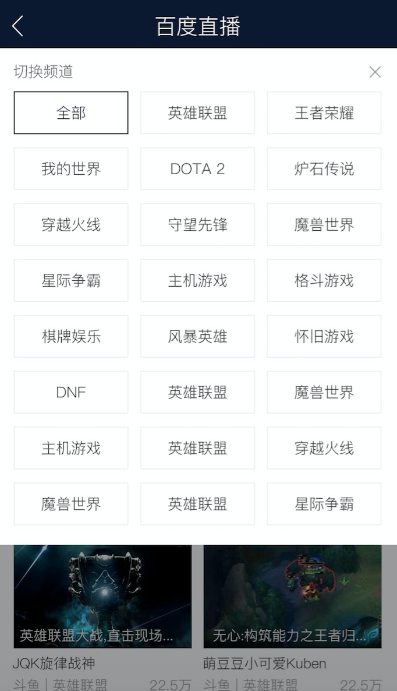

# 谢玲娟

> 从03.20-03.24

## 本周跟进

|内容 |类型|进度 | pv/天 | 
|---|---|---|---|
|游戏直播|新增|UE终稿delay到3.8给全，开发5天,联调delay3天，预计28左右上线|全量pv预计400w|

## 游戏直播

* 背景：直播作为一种快速发展的新媒体形式，无论是数量上、内容上，都在极度扩张，而搜索对直播这类新内容的掌控力较弱。以搜索做入口，可以去聚合多家平台内容，满足并激发用户观看游戏&娱乐直播需求。

* 收益：全量pv 400w

* 工作量评估

	* 需求量：新增4个情景页，1个结果页

	* 风险：资源方接入合作页，可能涉及到fe的沟通成本和开发联调工作。按照之前fe的经验，接入一个资源方时间为0.5天或者2周都有可能。

* 完成情况

	* 3.1需求评审

	* 3.3给到UE终稿

	* 3.16联调，fe8天工作量

	* 预计3.23上线

	* --------------------

	* UE稿delay到3.8给全
	
	* 3.16联调

	* 预计3.24上线
	
	* --------------------

	* 联调到提测delay3天。预计下周3.28左右上线

	* delay原因：1、情境页环境给出时间+1天;2、跟资源方沟通联调成本+1天；3、二级tag开发成组件，没有放到排期中。
	
	

* 效果图:

* 线下地址：http://cp01-ala-fe-7.epc.baidu.com:8003/sf?openapi=1&dspName=iphone&from_sf=1&pd=baidulive_sf_page&resource_id=4520&word=%E7%99%BE%E5%BA%A6%E7%9B%B4%E6%92%AD&title=%E7%99%BE%E5%BA%A6%E7%9B%B4%E6%92%AD%E8%81%9A%E5%90%88&ext=%7B%22sf_tab_name%22%3A%22%E6%8E%A8%E8%8D%90%22%7D&frsrcid=4519&frorder=4&lid=7282185681037873896&_nocache=1490327588792
	
	
