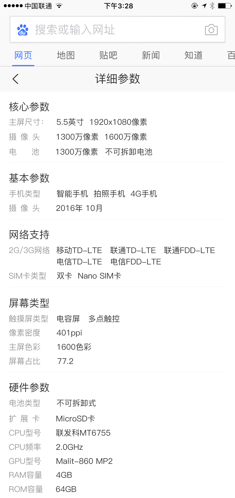
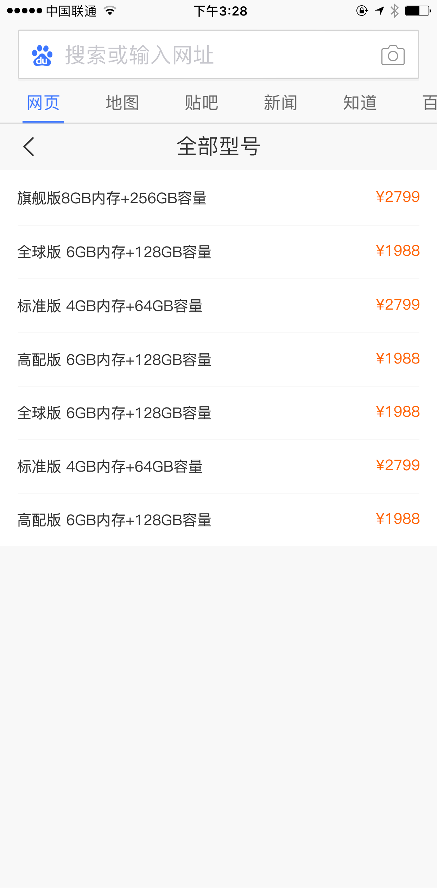
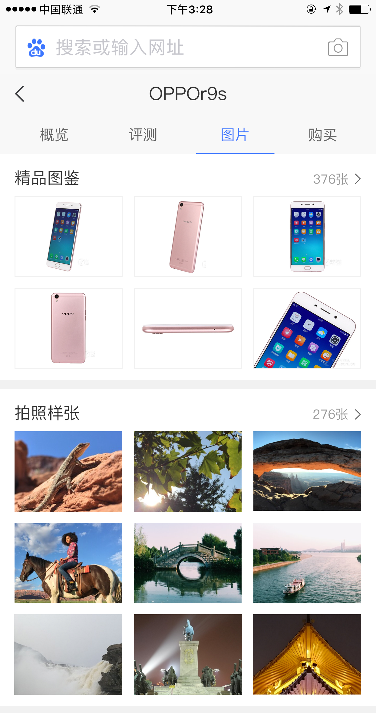

# 杨露

> 2017年3月20日~2017年3月24日

#### 商品3c类卡片 （项目状态:开发中）
- 背景：由于商品搜索结果对用户需求的满足不够好，现在用户已养成了去垂直的商品网站进行搜索+购物的习惯。希望引入优质的商品资源，全面地满足用户需求的同时，通过内容从消费决策阶段切入，培养用户来百度搜商品的习惯。

- 收益：预计覆盖600wpv

- 工作量评估：
    - 3c结果页
        - 参数卡
    - 3c情景页
        - 概览页
        - 全部参数卡
        - 图片卡

- 本周进展：
    - 本周二（3.21）确定概览页，参数卡schema格式，后段给出demo数据并在测试环境召回
    - 本周三（3.22）开发基本样式功能
    - 本周四（3.23）一些数据的细节要求还在与rd，pm沟通中
- 排期计划：
    －预计下周开发完成

- 效果图：
    

    
    
    
    

 