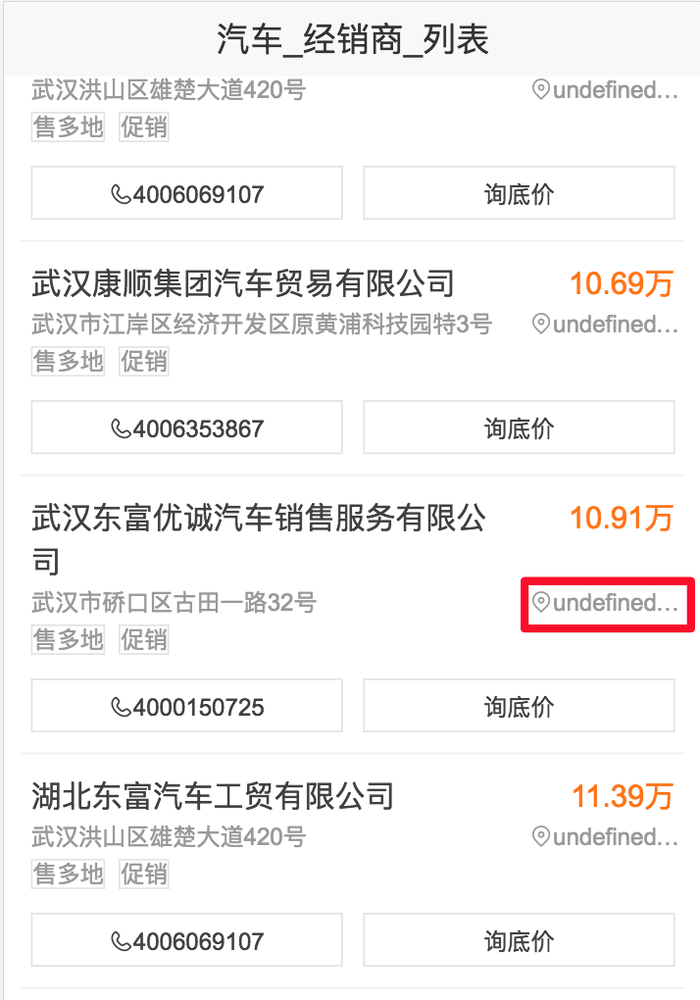

# 杨奇

> 2017年3月10日~2017年3月17日

#### 汽车项目 （项目状态:开发完成） @ 杨奇 
- 背景：本项目是满足搜索上新车部分的需求，重点满足用户选车的需求。 影响选车的决策因素很多，主要有：配置、报价、口碑、评测（文章、视频）等。从query分析可看出，选车需求的用户的TOP QUERY为车系词、品牌词以及泛需求词。
- 收益：影响PV 970w 
- **工作量评估** 
  - 需求量：
  完成3个情景页卡片，联调经销商列表页
  - 开发风险：
     - 情景页同时需要用同步获取数据和异步获取数据
  - 沟通风险：
     - 经销商列表页目前rd同学定位的距离数据和按距离排序的数据没有给出，预计4.10日给出数据，先联调默认排序的异步接口
- **完成情况** 
   - 3月19日 开始开发
   - 3月24日 开发完毕
- 本周进展
   - 完成了经销商详情页，车型配置页，车型概览页的开发
   - 经销商列表页默认排序的异步接口部分联调完毕
- **排期计划**
   - 3月末  和rd联调
- 效果图
    

    

    

    

    

    

    

